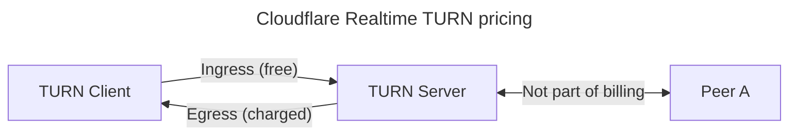

[Skip to content](#main-content)

> Documentation Index  
> Fetch the complete documentation index at: https://developers.cloudflare.com/realtime/llms.txt  
> Use this file to discover all available pages before exploring further.

Docs

[Directory](/directory/)[API](/api/)[SDKs](/fundamentals/api/reference/sdks/)[Changelog](/changelog/)

SearchCtrlK

[Log inDashboard](https://dash.cloudflare.com/)

[Realtime](/realtime/)

/

  - [Overview](/realtime/)

  - 
    
    

    
    RealtimeKit
    
    

    
    

    
      - [Overview](/realtime/realtimekit/)
    
      - [Quickstart](/realtime/realtimekit/quickstart/)
    
      - 
        
        

        
        Concepts
        
        

        
        

        
          - [Overview](/realtime/realtimekit/concepts/)
          - [Meeting](/realtime/realtimekit/concepts/meeting/)
          - [Preset](/realtime/realtimekit/concepts/preset/)
          - [Participant](/realtime/realtimekit/concepts/participant/)
          - [Session Lifecycle](/realtime/realtimekit/concepts/session-lifecycle/)
        
        

        
        

        
        

    
      - [Select SDK(s)](/realtime/realtimekit/sdk-selection/)
    
      - 
        
        

        
        Build using UI Kit
        
        

        
        

        
          - [Getting Started](/realtime/realtimekit/ui-kit/)
        
          - [State Management](/realtime/realtimekit/ui-kit/state-management/)
        
          - [Component Library](/realtime/realtimekit/ui-kit/component-library/)
        
          - [Build Your Own UI](/realtime/realtimekit/ui-kit/build-your-own-ui/)
        
          - [Add Custom Header](/realtime/realtimekit/ui-kit/custom-header/)
        
          - [Add Custom Controlbar](/realtime/realtimekit/ui-kit/custom-controlbar/)
        
          - [UI Kit Addons](/realtime/realtimekit/ui-kit/addons/)
        
          - 
            
            

            
            Customise Branding
            
            

            
            

            
              - [Icons](/realtime/realtimekit/ui-kit/branding/)
              - [Design System](/realtime/realtimekit/ui-kit/branding/design-system/)
            
            

            
            

            
            

        
          - [Meeting Locale](/realtime/realtimekit/ui-kit/meeting-locale/)
        
          - [Breakout Rooms](/realtime/realtimekit/ui-kit/breakout-rooms/)
        
          - 
            
            

            
            Component Reference
            
            

            
            

            
              - 
                
                

                
                Android
                
                

                
                

                
                  - [RtkAudioDeviceSelector](/realtime/realtimekit/ui-kit/api-reference/android/audio-device-selector/)
                  - [RtkAvatarView](/realtime/realtimekit/ui-kit/api-reference/android/avatar-view/)
                  - [RtkButton](/realtime/realtimekit/ui-kit/api-reference/android/button/)
                  - [RtkCameraToggleButton](/realtime/realtimekit/ui-kit/api-reference/android/camera-toggle/)
                  - [RtkChatBottomSheet](/realtime/realtimekit/ui-kit/api-reference/android/chat/)
                  - [RtkClockView](/realtime/realtimekit/ui-kit/api-reference/android/clock-view/)
                  - [RtkControlBarButton](/realtime/realtimekit/ui-kit/api-reference/android/control-bar-button/)
                  - [RtkControlBarView](/realtime/realtimekit/ui-kit/api-reference/android/control-bar-view/)
                  - [RtkCreatePollBottomSheet](/realtime/realtimekit/ui-kit/api-reference/android/create-poll/)
                  - [RtkDesignTokens](/realtime/realtimekit/ui-kit/api-reference/android/design-tokens/)
                  - [RtkErrorView](/realtime/realtimekit/ui-kit/api-reference/android/error-view/)
                  - [RtkGridPaginatorView](/realtime/realtimekit/ui-kit/api-reference/android/grid-paginator/)
                  - [RtkGridView](/realtime/realtimekit/ui-kit/api-reference/android/grid-view/)
                  - [RtkHeaderView](/realtime/realtimekit/ui-kit/api-reference/android/header-view/)
                  - [RtkJoinButton](/realtime/realtimekit/ui-kit/api-reference/android/join-button/)
                  - [RtkJoinLivestreamButton](/realtime/realtimekit/ui-kit/api-reference/android/join-livestream-button/)
                  - [RtkJoinStageDialog](/realtime/realtimekit/ui-kit/api-reference/android/join-stage-dialog/)
                  - [RtkLeaveButton](/realtime/realtimekit/ui-kit/api-reference/android/leave-button/)
                  - [RtkLeaveMeetingView](/realtime/realtimekit/ui-kit/api-reference/android/leave-meeting-dialog/)
                  - [RtkLivestreamControlBarView](/realtime/realtimekit/ui-kit/api-reference/android/livestream-control-bar/)
                  - [RtkLivestreamHeaderView](/realtime/realtimekit/ui-kit/api-reference/android/livestream-header-view/)
                  - [RtkLivestreamIndicator](/realtime/realtimekit/ui-kit/api-reference/android/livestream-indicator/)
                  - [RtkLivestreamToggleButton](/realtime/realtimekit/ui-kit/api-reference/android/livestream-toggle-button/)
                  - [RtkLivestreamViewerCount](/realtime/realtimekit/ui-kit/api-reference/android/livestream-viewer-count/)
                  - [RtkLoaderView](/realtime/realtimekit/ui-kit/api-reference/android/loader-view/)
                  - [RtkMeetingActivity](/realtime/realtimekit/ui-kit/api-reference/android/meeting-activity/)
                  - [RtkMeetingControlBarView](/realtime/realtimekit/ui-kit/api-reference/android/meeting-control-bar/)
                  - [RtkMeetingHeaderView](/realtime/realtimekit/ui-kit/api-reference/android/meeting-header/)
                  - [RtkMeetingOptionBottomSheet](/realtime/realtimekit/ui-kit/api-reference/android/meeting-option-bottomsheet/)
                  - [RtkMeetingTitleView](/realtime/realtimekit/ui-kit/api-reference/android/meeting-title-view/)
                  - [RtkMicToggleButton](/realtime/realtimekit/ui-kit/api-reference/android/mic-toggle/)
                  - [RtkMoreToggleButton](/realtime/realtimekit/ui-kit/api-reference/android/more-toggle-button/)
                  - [RtkNameTagView](/realtime/realtimekit/ui-kit/api-reference/android/name-tag-view/)
                  - [RtkParticipantAudioIndicator](/realtime/realtimekit/ui-kit/api-reference/android/participant-audio-indicator/)
                  - [RtkParticipantCountView](/realtime/realtimekit/ui-kit/api-reference/android/participant-count-view/)
                  - [RtkParticipantsFragment](/realtime/realtimekit/ui-kit/api-reference/android/participants/)
                  - [RtkParticipantTileView](/realtime/realtimekit/ui-kit/api-reference/android/participant-tile-view/)
                  - [RtkParticipantVideoIndicator](/realtime/realtimekit/ui-kit/api-reference/android/participant-video-indicator/)
                  - [RtkPluginsBottomSheet](/realtime/realtimekit/ui-kit/api-reference/android/plugins/)
                  - [RtkPollsBottomSheet](/realtime/realtimekit/ui-kit/api-reference/android/polls/)
                  - [RtkRecordingIndicator](/realtime/realtimekit/ui-kit/api-reference/android/recording-indicator/)
                  - [RtkSettingsBottomsheet](/realtime/realtimekit/ui-kit/api-reference/android/settings-bottomsheet/)
                  - [RtkSettingsFragment](/realtime/realtimekit/ui-kit/api-reference/android/settings-fragment/)
                  - [RtkSetupFragment](/realtime/realtimekit/ui-kit/api-reference/android/setup-screen/)
                  - [RtkTabSyncToggleButton](/realtime/realtimekit/ui-kit/api-reference/android/tab-sync-toggle-button/)
                  - [RtkVideoDeviceSelector](/realtime/realtimekit/ui-kit/api-reference/android/video-device-selector/)
                  - [RtkVideoPeer](/realtime/realtimekit/ui-kit/api-reference/android/video-peer/)
                  - [RtkWebinarControlBarView](/realtime/realtimekit/ui-kit/api-reference/android/webinar-control-bar/)
                  - [RtkWebinarStageToggleButton](/realtime/realtimekit/ui-kit/api-reference/android/webinar-stage-toggle/)
                
                

                
                

                
                

            
              - 
                
                

                
                Angular
                
                

                
                

                
                  - [rtk-ai](/realtime/realtimekit/ui-kit/api-reference/angular/rtk-ai/)
                  - [rtk-ai-toggle](/realtime/realtimekit/ui-kit/api-reference/angular/rtk-ai-toggle/)
                  - [rtk-ai-transcriptions](/realtime/realtimekit/ui-kit/api-reference/angular/rtk-ai-transcriptions/)
                  - [rtk-audio-grid](/realtime/realtimekit/ui-kit/api-reference/angular/rtk-audio-grid/)
                  - [rtk-audio-tile](/realtime/realtimekit/ui-kit/api-reference/angular/rtk-audio-tile/)
                  - [rtk-audio-visualizer](/realtime/realtimekit/ui-kit/api-reference/angular/rtk-audio-visualizer/)
                  - [rtk-avatar](/realtime/realtimekit/ui-kit/api-reference/angular/rtk-avatar/)
                  - [rtk-breakout-room-manager](/realtime/realtimekit/ui-kit/api-reference/angular/rtk-breakout-room-manager/)
                  - [rtk-breakout-room-participants](/realtime/realtimekit/ui-kit/api-reference/angular/rtk-breakout-room-participants/)
                  - [rtk-breakout-rooms-manager](/realtime/realtimekit/ui-kit/api-reference/angular/rtk-breakout-rooms-manager/)
                  - [rtk-breakout-rooms-toggle](/realtime/realtimekit/ui-kit/api-reference/angular/rtk-breakout-rooms-toggle/)
                  - [rtk-broadcast-message-modal](/realtime/realtimekit/ui-kit/api-reference/angular/rtk-broadcast-message-modal/)
                  - [rtk-button](/realtime/realtimekit/ui-kit/api-reference/angular/rtk-button/)
                  - [rtk-camera-selector](/realtime/realtimekit/ui-kit/api-reference/angular/rtk-camera-selector/)
                  - [rtk-camera-toggle](/realtime/realtimekit/ui-kit/api-reference/angular/rtk-camera-toggle/)
                  - [rtk-caption-toggle](/realtime/realtimekit/ui-kit/api-reference/angular/rtk-caption-toggle/)
                  - [rtk-chat](/realtime/realtimekit/ui-kit/api-reference/angular/rtk-chat/)
                  - [rtk-chat-composer-ui](/realtime/realtimekit/ui-kit/api-reference/angular/rtk-chat-composer-ui/)
                  - [rtk-chat-composer-view](/realtime/realtimekit/ui-kit/api-reference/angular/rtk-chat-composer-view/)
                  - [rtk-chat-header](/realtime/realtimekit/ui-kit/api-reference/angular/rtk-chat-header/)
                  - [rtk-chat-message](/realtime/realtimekit/ui-kit/api-reference/angular/rtk-chat-message/)
                  - [rtk-chat-messages-ui](/realtime/realtimekit/ui-kit/api-reference/angular/rtk-chat-messages-ui/)
                  - [rtk-chat-messages-ui-paginated](/realtime/realtimekit/ui-kit/api-reference/angular/rtk-chat-messages-ui-paginated/)
                  - [rtk-chat-search-results](/realtime/realtimekit/ui-kit/api-reference/angular/rtk-chat-search-results/)
                  - [rtk-chat-selector](/realtime/realtimekit/ui-kit/api-reference/angular/rtk-chat-selector/)
                  - [rtk-chat-selector-ui](/realtime/realtimekit/ui-kit/api-reference/angular/rtk-chat-selector-ui/)
                  - [rtk-chat-toggle](/realtime/realtimekit/ui-kit/api-reference/angular/rtk-chat-toggle/)
                  - [rtk-clock](/realtime/realtimekit/ui-kit/api-reference/angular/rtk-clock/)
                  - [rtk-confirmation-modal](/realtime/realtimekit/ui-kit/api-reference/angular/rtk-confirmation-modal/)
                  - [rtk-controlbar](/realtime/realtimekit/ui-kit/api-reference/angular/rtk-controlbar/)
                  - [rtk-controlbar-button](/realtime/realtimekit/ui-kit/api-reference/angular/rtk-controlbar-button/)
                  - [rtk-counter](/realtime/realtimekit/ui-kit/api-reference/angular/rtk-counter/)
                  - [rtk-debugger](/realtime/realtimekit/ui-kit/api-reference/angular/rtk-debugger/)
                  - [rtk-debugger-audio](/realtime/realtimekit/ui-kit/api-reference/angular/rtk-debugger-audio/)
                  - [rtk-debugger-screenshare](/realtime/realtimekit/ui-kit/api-reference/angular/rtk-debugger-screenshare/)
                  - [rtk-debugger-system](/realtime/realtimekit/ui-kit/api-reference/angular/rtk-debugger-system/)
                  - [rtk-debugger-toggle](/realtime/realtimekit/ui-kit/api-reference/angular/rtk-debugger-toggle/)
                  - [rtk-debugger-video](/realtime/realtimekit/ui-kit/api-reference/angular/rtk-debugger-video/)
                  - [rtk-dialog](/realtime/realtimekit/ui-kit/api-reference/angular/rtk-dialog/)
                  - [rtk-dialog-manager](/realtime/realtimekit/ui-kit/api-reference/angular/rtk-dialog-manager/)
                  - [rtk-draft-attachment-view](/realtime/realtimekit/ui-kit/api-reference/angular/rtk-draft-attachment-view/)
                  - [rtk-emoji-picker](/realtime/realtimekit/ui-kit/api-reference/angular/rtk-emoji-picker/)
                  - [rtk-emoji-picker-button](/realtime/realtimekit/ui-kit/api-reference/angular/rtk-emoji-picker-button/)
                  - [rtk-ended-screen](/realtime/realtimekit/ui-kit/api-reference/angular/rtk-ended-screen/)
                  - [rtk-file-dropzone](/realtime/realtimekit/ui-kit/api-reference/angular/rtk-file-dropzone/)
                  - [rtk-file-message](/realtime/realtimekit/ui-kit/api-reference/angular/rtk-file-message/)
                  - [rtk-file-message-view](/realtime/realtimekit/ui-kit/api-reference/angular/rtk-file-message-view/)
                  - [rtk-file-picker-button](/realtime/realtimekit/ui-kit/api-reference/angular/rtk-file-picker-button/)
                  - [rtk-fullscreen-toggle](/realtime/realtimekit/ui-kit/api-reference/angular/rtk-fullscreen-toggle/)
                  - [rtk-grid](/realtime/realtimekit/ui-kit/api-reference/angular/rtk-grid/)
                  - [rtk-grid-pagination](/realtime/realtimekit/ui-kit/api-reference/angular/rtk-grid-pagination/)
                  - [rtk-header](/realtime/realtimekit/ui-kit/api-reference/angular/rtk-header/)
                  - [rtk-icon](/realtime/realtimekit/ui-kit/api-reference/angular/rtk-icon/)
                  - [rtk-idle-screen](/realtime/realtimekit/ui-kit/api-reference/angular/rtk-idle-screen/)
                  - [rtk-image-message](/realtime/realtimekit/ui-kit/api-reference/angular/rtk-image-message/)
                  - [rtk-image-message-view](/realtime/realtimekit/ui-kit/api-reference/angular/rtk-image-message-view/)
                  - [rtk-image-viewer](/realtime/realtimekit/ui-kit/api-reference/angular/rtk-image-viewer/)
                  - [rtk-information-tooltip](/realtime/realtimekit/ui-kit/api-reference/angular/rtk-information-tooltip/)
                  - [rtk-join-stage](/realtime/realtimekit/ui-kit/api-reference/angular/rtk-join-stage/)
                  - [rtk-leave-button](/realtime/realtimekit/ui-kit/api-reference/angular/rtk-leave-button/)
                  - [rtk-leave-meeting](/realtime/realtimekit/ui-kit/api-reference/angular/rtk-leave-meeting/)
                  - [rtk-livestream-indicator](/realtime/realtimekit/ui-kit/api-reference/angular/rtk-livestream-indicator/)
                  - [rtk-livestream-player](/realtime/realtimekit/ui-kit/api-reference/angular/rtk-livestream-player/)
                  - [rtk-livestream-toggle](/realtime/realtimekit/ui-kit/api-reference/angular/rtk-livestream-toggle/)
                  - [rtk-logo](/realtime/realtimekit/ui-kit/api-reference/angular/rtk-logo/)
                  - [rtk-markdown-view](/realtime/realtimekit/ui-kit/api-reference/angular/rtk-markdown-view/)
                  - [rtk-meeting](/realtime/realtimekit/ui-kit/api-reference/angular/rtk-meeting/)
                  - [rtk-meeting-title](/realtime/realtimekit/ui-kit/api-reference/angular/rtk-meeting-title/)
                  - [rtk-menu](/realtime/realtimekit/ui-kit/api-reference/angular/rtk-menu/)
                  - [rtk-menu-item](/realtime/realtimekit/ui-kit/api-reference/angular/rtk-menu-item/)
                  - [rtk-menu-list](/realtime/realtimekit/ui-kit/api-reference/angular/rtk-menu-list/)
                  - [rtk-message-list-view](/realtime/realtimekit/ui-kit/api-reference/angular/rtk-message-list-view/)
                  - [rtk-message-view](/realtime/realtimekit/ui-kit/api-reference/angular/rtk-message-view/)
                  - [rtk-mic-toggle](/realtime/realtimekit/ui-kit/api-reference/angular/rtk-mic-toggle/)
                  - [rtk-microphone-selector](/realtime/realtimekit/ui-kit/api-reference/angular/rtk-microphone-selector/)
                  - [rtk-mixed-grid](/realtime/realtimekit/ui-kit/api-reference/angular/rtk-mixed-grid/)
                  - [rtk-more-toggle](/realtime/realtimekit/ui-kit/api-reference/angular/rtk-more-toggle/)
                  - [rtk-mute-all-button](/realtime/realtimekit/ui-kit/api-reference/angular/rtk-mute-all-button/)
                  - [rtk-mute-all-confirmation](/realtime/realtimekit/ui-kit/api-reference/angular/rtk-mute-all-confirmation/)
                  - [rtk-name-tag](/realtime/realtimekit/ui-kit/api-reference/angular/rtk-name-tag/)
                  - [rtk-network-indicator](/realtime/realtimekit/ui-kit/api-reference/angular/rtk-network-indicator/)
                  - [rtk-notification](/realtime/realtimekit/ui-kit/api-reference/angular/rtk-notification/)
                  - [rtk-notifications](/realtime/realtimekit/ui-kit/api-reference/angular/rtk-notifications/)
                  - [rtk-overlay-modal](/realtime/realtimekit/ui-kit/api-reference/angular/rtk-overlay-modal/)
                  - [rtk-paginated-list](/realtime/realtimekit/ui-kit/api-reference/angular/rtk-paginated-list/)
                  - [rtk-participant](/realtime/realtimekit/ui-kit/api-reference/angular/rtk-participant/)
                  - [rtk-participant-count](/realtime/realtimekit/ui-kit/api-reference/angular/rtk-participant-count/)
                  - [rtk-participant-setup](/realtime/realtimekit/ui-kit/api-reference/angular/rtk-participant-setup/)
                  - [rtk-participant-tile](/realtime/realtimekit/ui-kit/api-reference/angular/rtk-participant-tile/)
                  - [rtk-participants](/realtime/realtimekit/ui-kit/api-reference/angular/rtk-participants/)
                  - [rtk-participants-audio](/realtime/realtimekit/ui-kit/api-reference/angular/rtk-participants-audio/)
                  - [rtk-participants-stage-list](/realtime/realtimekit/ui-kit/api-reference/angular/rtk-participants-stage-list/)
                  - [rtk-participants-stage-queue](/realtime/realtimekit/ui-kit/api-reference/angular/rtk-participants-stage-queue/)
                  - [rtk-participants-toggle](/realtime/realtimekit/ui-kit/api-reference/angular/rtk-participants-toggle/)
                  - [rtk-participants-viewer-list](/realtime/realtimekit/ui-kit/api-reference/angular/rtk-participants-viewer-list/)
                  - [rtk-participants-waiting-list](/realtime/realtimekit/ui-kit/api-reference/angular/rtk-participants-waiting-list/)
                  - [rtk-permissions-message](/realtime/realtimekit/ui-kit/api-reference/angular/rtk-permissions-message/)
                  - [rtk-pinned-message-selector](/realtime/realtimekit/ui-kit/api-reference/angular/rtk-pinned-message-selector/)
                  - [rtk-pip-toggle](/realtime/realtimekit/ui-kit/api-reference/angular/rtk-pip-toggle/)
                  - [rtk-plugin-main](/realtime/realtimekit/ui-kit/api-reference/angular/rtk-plugin-main/)
                  - [rtk-plugins](/realtime/realtimekit/ui-kit/api-reference/angular/rtk-plugins/)
                  - [rtk-plugins-toggle](/realtime/realtimekit/ui-kit/api-reference/angular/rtk-plugins-toggle/)
                  - [rtk-poll](/realtime/realtimekit/ui-kit/api-reference/angular/rtk-poll/)
                  - [rtk-poll-form](/realtime/realtimekit/ui-kit/api-reference/angular/rtk-poll-form/)
                  - [rtk-polls](/realtime/realtimekit/ui-kit/api-reference/angular/rtk-polls/)
                  - [rtk-polls-toggle](/realtime/realtimekit/ui-kit/api-reference/angular/rtk-polls-toggle/)
                  - [rtk-recording-indicator](/realtime/realtimekit/ui-kit/api-reference/angular/rtk-recording-indicator/)
                  - [rtk-recording-toggle](/realtime/realtimekit/ui-kit/api-reference/angular/rtk-recording-toggle/)
                  - [rtk-screen-share-toggle](/realtime/realtimekit/ui-kit/api-reference/angular/rtk-screen-share-toggle/)
                  - [rtk-screenshare-view](/realtime/realtimekit/ui-kit/api-reference/angular/rtk-screenshare-view/)
                  - [rtk-settings](/realtime/realtimekit/ui-kit/api-reference/angular/rtk-settings/)
                  - [rtk-settings-audio](/realtime/realtimekit/ui-kit/api-reference/angular/rtk-settings-audio/)
                  - [rtk-settings-toggle](/realtime/realtimekit/ui-kit/api-reference/angular/rtk-settings-toggle/)
                  - [rtk-settings-video](/realtime/realtimekit/ui-kit/api-reference/angular/rtk-settings-video/)
                  - [rtk-setup-screen](/realtime/realtimekit/ui-kit/api-reference/angular/rtk-setup-screen/)
                  - [rtk-sidebar](/realtime/realtimekit/ui-kit/api-reference/angular/rtk-sidebar/)
                  - [rtk-sidebar-ui](/realtime/realtimekit/ui-kit/api-reference/angular/rtk-sidebar-ui/)
                  - [rtk-simple-grid](/realtime/realtimekit/ui-kit/api-reference/angular/rtk-simple-grid/)
                  - [rtk-speaker-selector](/realtime/realtimekit/ui-kit/api-reference/angular/rtk-speaker-selector/)
                  - [rtk-spinner](/realtime/realtimekit/ui-kit/api-reference/angular/rtk-spinner/)
                  - [rtk-spotlight-grid](/realtime/realtimekit/ui-kit/api-reference/angular/rtk-spotlight-grid/)
                  - [rtk-spotlight-indicator](/realtime/realtimekit/ui-kit/api-reference/angular/rtk-spotlight-indicator/)
                  - [rtk-stage](/realtime/realtimekit/ui-kit/api-reference/angular/rtk-stage/)
                  - [rtk-stage-toggle](/realtime/realtimekit/ui-kit/api-reference/angular/rtk-stage-toggle/)
                  - [rtk-switch](/realtime/realtimekit/ui-kit/api-reference/angular/rtk-switch/)
                  - [rtk-tab-bar](/realtime/realtimekit/ui-kit/api-reference/angular/rtk-tab-bar/)
                  - [rtk-text-composer-view](/realtime/realtimekit/ui-kit/api-reference/angular/rtk-text-composer-view/)
                  - [rtk-text-message](/realtime/realtimekit/ui-kit/api-reference/angular/rtk-text-message/)
                  - [rtk-text-message-view](/realtime/realtimekit/ui-kit/api-reference/angular/rtk-text-message-view/)
                  - [rtk-tooltip](/realtime/realtimekit/ui-kit/api-reference/angular/rtk-tooltip/)
                  - [rtk-transcript](/realtime/realtimekit/ui-kit/api-reference/angular/rtk-transcript/)
                  - [rtk-transcripts](/realtime/realtimekit/ui-kit/api-reference/angular/rtk-transcripts/)
                  - [rtk-ui-provider](/realtime/realtimekit/ui-kit/api-reference/angular/rtk-ui-provider/)
                  - [rtk-viewer-count](/realtime/realtimekit/ui-kit/api-reference/angular/rtk-viewer-count/)
                  - [rtk-virtualized-participant-list](/realtime/realtimekit/ui-kit/api-reference/angular/rtk-virtualized-participant-list/)
                  - [rtk-waiting-screen](/realtime/realtimekit/ui-kit/api-reference/angular/rtk-waiting-screen/)
                
                

                
                

                
                

            
              - 
                
                

                
                iOS
                
                

                
                

                
                  - [AppTheme](/realtime/realtimekit/ui-kit/api-reference/ios/app-theme/)
                  - [DesignLibrary](/realtime/realtimekit/ui-kit/api-reference/ios/design-library/)
                  - [GridView](/realtime/realtimekit/ui-kit/api-reference/ios/grid-view/)
                  - [MeetingViewController](/realtime/realtimekit/ui-kit/api-reference/ios/meeting-view-controller/)
                  - [RtkActiveTabSelectorView](/realtime/realtimekit/ui-kit/api-reference/ios/rtk-active-tab-selector-view/)
                  - [RtkAudioButtonControlBar](/realtime/realtimekit/ui-kit/api-reference/ios/rtk-audio-button-control-bar/)
                  - [RtkAvatarView](/realtime/realtimekit/ui-kit/api-reference/ios/rtk-avatar-view/)
                  - [RtkButton](/realtime/realtimekit/ui-kit/api-reference/ios/rtk-button/)
                  - [RtkClockView](/realtime/realtimekit/ui-kit/api-reference/ios/rtk-clock-view/)
                  - [RtkControlBar](/realtime/realtimekit/ui-kit/api-reference/ios/rtk-control-bar/)
                  - [RtkControlBarButton](/realtime/realtimekit/ui-kit/api-reference/ios/rtk-control-bar-button/)
                  - [RtkEndMeetingControlBarButton](/realtime/realtimekit/ui-kit/api-reference/ios/rtk-end-meeting-control-bar-button/)
                  - [RtkEventSelfListener](/realtime/realtimekit/ui-kit/api-reference/ios/rtk-event-self-listener/)
                  - [RtkImage](/realtime/realtimekit/ui-kit/api-reference/ios/rtk-image/)
                  - [RtkJoinButton](/realtime/realtimekit/ui-kit/api-reference/ios/rtk-join-button/)
                  - [RtkLabel](/realtime/realtimekit/ui-kit/api-reference/ios/rtk-label/)
                  - [RtkLeaveDialog](/realtime/realtimekit/ui-kit/api-reference/ios/rtk-leave-dialog/)
                  - [RtkMeetingControlBar](/realtime/realtimekit/ui-kit/api-reference/ios/rtk-meeting-control-bar/)
                  - [RtkMeetingHeaderView](/realtime/realtimekit/ui-kit/api-reference/ios/rtk-meeting-header-view/)
                  - [RtkMeetingNameTag](/realtime/realtimekit/ui-kit/api-reference/ios/rtk-meeting-name-tag/)
                  - [RtkMeetingTitleLabel](/realtime/realtimekit/ui-kit/api-reference/ios/rtk-meeting-title-label/)
                  - [RtkMoreButtonControlBar](/realtime/realtimekit/ui-kit/api-reference/ios/rtk-more-button-control-bar/)
                  - [RtkMoreMenu](/realtime/realtimekit/ui-kit/api-reference/ios/rtk-more-menu/)
                  - [RtkNameTag](/realtime/realtimekit/ui-kit/api-reference/ios/rtk-name-tag/)
                  - [RtkNavigationBar](/realtime/realtimekit/ui-kit/api-reference/ios/rtk-navigation-bar/)
                  - [RtkNotificationBadgeView](/realtime/realtimekit/ui-kit/api-reference/ios/rtk-notification-badge-view/)
                  - [RtkNotificationConfig](/realtime/realtimekit/ui-kit/api-reference/ios/rtk-notification-config/)
                  - [RtkParticipantCountView](/realtime/realtimekit/ui-kit/api-reference/ios/rtk-participant-count-view/)
                  - [RtkParticipantTileView](/realtime/realtimekit/ui-kit/api-reference/ios/rtk-participant-tile-view/)
                  - [RtkPluginScreenShareTabButton](/realtime/realtimekit/ui-kit/api-reference/ios/rtk-plugin-screen-share-tab-button/)
                  - [RtkPluginsView](/realtime/realtimekit/ui-kit/api-reference/ios/rtk-plugins-view/)
                  - [RtkRecordingView](/realtime/realtimekit/ui-kit/api-reference/ios/rtk-recording-view/)
                  - [RtkSetupViewController](/realtime/realtimekit/ui-kit/api-reference/ios/rtk-setup-view-controller/)
                  - [RtkStageActionButtonControlBar](/realtime/realtimekit/ui-kit/api-reference/ios/rtk-stage-action-button-control-bar/)
                  - [RtkSwitchCameraButtonControlBar](/realtime/realtimekit/ui-kit/api-reference/ios/rtk-switch-camera-button-control-bar/)
                  - [RtkVideoButtonControlBar](/realtime/realtimekit/ui-kit/api-reference/ios/rtk-video-button-control-bar/)
                  - [RtkVideoView](/realtime/realtimekit/ui-kit/api-reference/ios/rtk-video-view/)
                  - [RtkWaitListParticipantUpdateEventListener](/realtime/realtimekit/ui-kit/api-reference/ios/rtk-wait-list-participant-update-event-listener/)
                
                

                
                

                
                

            
              - 
                
                

                
                React
                
                

                
                

                
                  - [RtkAi](/realtime/realtimekit/ui-kit/api-reference/react/rtkai/)
                  - [RtkAiToggle](/realtime/realtimekit/ui-kit/api-reference/react/rtkaitoggle/)
                  - [RtkAiTranscriptions](/realtime/realtimekit/ui-kit/api-reference/react/rtkaitranscriptions/)
                  - [RtkAudioGrid](/realtime/realtimekit/ui-kit/api-reference/react/rtkaudiogrid/)
                  - [RtkAudioTile](/realtime/realtimekit/ui-kit/api-reference/react/rtkaudiotile/)
                  - [RtkAudioVisualizer](/realtime/realtimekit/ui-kit/api-reference/react/rtkaudiovisualizer/)
                  - [RtkAvatar](/realtime/realtimekit/ui-kit/api-reference/react/rtkavatar/)
                  - [RtkBreakoutRoomManager](/realtime/realtimekit/ui-kit/api-reference/react/rtkbreakoutroommanager/)
                  - [RtkBreakoutRoomParticipants](/realtime/realtimekit/ui-kit/api-reference/react/rtkbreakoutroomparticipants/)
                  - [RtkBreakoutRoomsManager](/realtime/realtimekit/ui-kit/api-reference/react/rtkbreakoutroomsmanager/)
                  - [RtkBreakoutRoomsToggle](/realtime/realtimekit/ui-kit/api-reference/react/rtkbreakoutroomstoggle/)
                  - [RtkBroadcastMessageModal](/realtime/realtimekit/ui-kit/api-reference/react/rtkbroadcastmessagemodal/)
                  - [RtkButton](/realtime/realtimekit/ui-kit/api-reference/react/rtkbutton/)
                  - [RtkCameraSelector](/realtime/realtimekit/ui-kit/api-reference/react/rtkcameraselector/)
                  - [RtkCameraToggle](/realtime/realtimekit/ui-kit/api-reference/react/rtkcameratoggle/)
                  - [RtkCaptionToggle](/realtime/realtimekit/ui-kit/api-reference/react/rtkcaptiontoggle/)
                  - [RtkChat](/realtime/realtimekit/ui-kit/api-reference/react/rtkchat/)
                  - [RtkChatComposerUi](/realtime/realtimekit/ui-kit/api-reference/react/rtkchatcomposerui/)
                  - [RtkChatComposerView](/realtime/realtimekit/ui-kit/api-reference/react/rtkchatcomposerview/)
                  - [RtkChatHeader](/realtime/realtimekit/ui-kit/api-reference/react/rtkchatheader/)
                  - [RtkChatMessage](/realtime/realtimekit/ui-kit/api-reference/react/rtkchatmessage/)
                  - [RtkChatMessagesUi](/realtime/realtimekit/ui-kit/api-reference/react/rtkchatmessagesui/)
                  - [RtkChatMessagesUiPaginated](/realtime/realtimekit/ui-kit/api-reference/react/rtkchatmessagesuipaginated/)
                  - [RtkChatSearchResults](/realtime/realtimekit/ui-kit/api-reference/react/rtkchatsearchresults/)
                  - [RtkChatSelector](/realtime/realtimekit/ui-kit/api-reference/react/rtkchatselector/)
                  - [RtkChatSelectorUi](/realtime/realtimekit/ui-kit/api-reference/react/rtkchatselectorui/)
                  - [RtkChatToggle](/realtime/realtimekit/ui-kit/api-reference/react/rtkchattoggle/)
                  - [RtkClock](/realtime/realtimekit/ui-kit/api-reference/react/rtkclock/)
                  - [RtkConfirmationModal](/realtime/realtimekit/ui-kit/api-reference/react/rtkconfirmationmodal/)
                  - [RtkControlbar](/realtime/realtimekit/ui-kit/api-reference/react/rtkcontrolbar/)
                  - [RtkControlbarButton](/realtime/realtimekit/ui-kit/api-reference/react/rtkcontrolbarbutton/)
                  - [RtkCounter](/realtime/realtimekit/ui-kit/api-reference/react/rtkcounter/)
                  - [RtkDebugger](/realtime/realtimekit/ui-kit/api-reference/react/rtkdebugger/)
                  - [RtkDebuggerAudio](/realtime/realtimekit/ui-kit/api-reference/react/rtkdebuggeraudio/)
                  - [RtkDebuggerScreenshare](/realtime/realtimekit/ui-kit/api-reference/react/rtkdebuggerscreenshare/)
                  - [RtkDebuggerSystem](/realtime/realtimekit/ui-kit/api-reference/react/rtkdebuggersystem/)
                  - [RtkDebuggerToggle](/realtime/realtimekit/ui-kit/api-reference/react/rtkdebuggertoggle/)
                  - [RtkDebuggerVideo](/realtime/realtimekit/ui-kit/api-reference/react/rtkdebuggervideo/)
                  - [RtkDialog](/realtime/realtimekit/ui-kit/api-reference/react/rtkdialog/)
                  - [RtkDialogManager](/realtime/realtimekit/ui-kit/api-reference/react/rtkdialogmanager/)
                  - [RtkDraftAttachmentView](/realtime/realtimekit/ui-kit/api-reference/react/rtkdraftattachmentview/)
                  - [RtkEmojiPicker](/realtime/realtimekit/ui-kit/api-reference/react/rtkemojipicker/)
                  - [RtkEmojiPickerButton](/realtime/realtimekit/ui-kit/api-reference/react/rtkemojipickerbutton/)
                  - [RtkEndedScreen](/realtime/realtimekit/ui-kit/api-reference/react/rtkendedscreen/)
                  - [RtkFileDropzone](/realtime/realtimekit/ui-kit/api-reference/react/rtkfiledropzone/)
                  - [RtkFileMessage](/realtime/realtimekit/ui-kit/api-reference/react/rtkfilemessage/)
                  - [RtkFileMessageView](/realtime/realtimekit/ui-kit/api-reference/react/rtkfilemessageview/)
                  - [RtkFilePickerButton](/realtime/realtimekit/ui-kit/api-reference/react/rtkfilepickerbutton/)
                  - [RtkFullscreenToggle](/realtime/realtimekit/ui-kit/api-reference/react/rtkfullscreentoggle/)
                  - [RtkGrid](/realtime/realtimekit/ui-kit/api-reference/react/rtkgrid/)
                  - [RtkGridPagination](/realtime/realtimekit/ui-kit/api-reference/react/rtkgridpagination/)
                  - [RtkHeader](/realtime/realtimekit/ui-kit/api-reference/react/rtkheader/)
                  - [RtkIcon](/realtime/realtimekit/ui-kit/api-reference/react/rtkicon/)
                  - [RtkIdleScreen](/realtime/realtimekit/ui-kit/api-reference/react/rtkidlescreen/)
                  - [RtkImageMessage](/realtime/realtimekit/ui-kit/api-reference/react/rtkimagemessage/)
                  - [RtkImageMessageView](/realtime/realtimekit/ui-kit/api-reference/react/rtkimagemessageview/)
                  - [RtkImageViewer](/realtime/realtimekit/ui-kit/api-reference/react/rtkimageviewer/)
                  - [RtkInformationTooltip](/realtime/realtimekit/ui-kit/api-reference/react/rtkinformationtooltip/)
                  - [RtkJoinStage](/realtime/realtimekit/ui-kit/api-reference/react/rtkjoinstage/)
                  - [RtkLeaveButton](/realtime/realtimekit/ui-kit/api-reference/react/rtkleavebutton/)
                  - [RtkLeaveMeeting](/realtime/realtimekit/ui-kit/api-reference/react/rtkleavemeeting/)
                  - [RtkLivestreamIndicator](/realtime/realtimekit/ui-kit/api-reference/react/rtklivestreamindicator/)
                  - [RtkLivestreamPlayer](/realtime/realtimekit/ui-kit/api-reference/react/rtklivestreamplayer/)
                  - [RtkLivestreamToggle](/realtime/realtimekit/ui-kit/api-reference/react/rtklivestreamtoggle/)
                  - [RtkLogo](/realtime/realtimekit/ui-kit/api-reference/react/rtklogo/)
                  - [RtkMarkdownView](/realtime/realtimekit/ui-kit/api-reference/react/rtkmarkdownview/)
                  - [RtkMeeting](/realtime/realtimekit/ui-kit/api-reference/react/rtkmeeting/)
                  - [RtkMeetingTitle](/realtime/realtimekit/ui-kit/api-reference/react/rtkmeetingtitle/)
                  - [RtkMenu](/realtime/realtimekit/ui-kit/api-reference/react/rtkmenu/)
                  - [RtkMenuItem](/realtime/realtimekit/ui-kit/api-reference/react/rtkmenuitem/)
                  - [RtkMenuList](/realtime/realtimekit/ui-kit/api-reference/react/rtkmenulist/)
                  - [RtkMessageListView](/realtime/realtimekit/ui-kit/api-reference/react/rtkmessagelistview/)
                  - [RtkMessageView](/realtime/realtimekit/ui-kit/api-reference/react/rtkmessageview/)
                  - [RtkMicrophoneSelector](/realtime/realtimekit/ui-kit/api-reference/react/rtkmicrophoneselector/)
                  - [RtkMicToggle](/realtime/realtimekit/ui-kit/api-reference/react/rtkmictoggle/)
                  - [RtkMixedGrid](/realtime/realtimekit/ui-kit/api-reference/react/rtkmixedgrid/)
                  - [RtkMoreToggle](/realtime/realtimekit/ui-kit/api-reference/react/rtkmoretoggle/)
                  - [RtkMuteAllButton](/realtime/realtimekit/ui-kit/api-reference/react/rtkmuteallbutton/)
                  - [RtkMuteAllConfirmation](/realtime/realtimekit/ui-kit/api-reference/react/rtkmuteallconfirmation/)
                  - [RtkNameTag](/realtime/realtimekit/ui-kit/api-reference/react/rtknametag/)
                  - [RtkNetworkIndicator](/realtime/realtimekit/ui-kit/api-reference/react/rtknetworkindicator/)
                  - [RtkNotification](/realtime/realtimekit/ui-kit/api-reference/react/rtknotification/)
                  - [RtkNotifications](/realtime/realtimekit/ui-kit/api-reference/react/rtknotifications/)
                  - [RtkOverlayModal](/realtime/realtimekit/ui-kit/api-reference/react/rtkoverlaymodal/)
                  - [RtkPaginatedList](/realtime/realtimekit/ui-kit/api-reference/react/rtkpaginatedlist/)
                  - [RtkParticipant](/realtime/realtimekit/ui-kit/api-reference/react/rtkparticipant/)
                  - [RtkParticipantCount](/realtime/realtimekit/ui-kit/api-reference/react/rtkparticipantcount/)
                  - [RtkParticipants](/realtime/realtimekit/ui-kit/api-reference/react/rtkparticipants/)
                  - [RtkParticipantsAudio](/realtime/realtimekit/ui-kit/api-reference/react/rtkparticipantsaudio/)
                  - [RtkParticipantSetup](/realtime/realtimekit/ui-kit/api-reference/react/rtkparticipantsetup/)
                  - [RtkParticipantsStageList](/realtime/realtimekit/ui-kit/api-reference/react/rtkparticipantsstagelist/)
                  - [RtkParticipantsStageQueue](/realtime/realtimekit/ui-kit/api-reference/react/rtkparticipantsstagequeue/)
                  - [RtkParticipantsToggle](/realtime/realtimekit/ui-kit/api-reference/react/rtkparticipantstoggle/)
                  - [RtkParticipantsViewerList](/realtime/realtimekit/ui-kit/api-reference/react/rtkparticipantsviewerlist/)
                  - [RtkParticipantsWaitingList](/realtime/realtimekit/ui-kit/api-reference/react/rtkparticipantswaitinglist/)
                  - [RtkParticipantTile](/realtime/realtimekit/ui-kit/api-reference/react/rtkparticipanttile/)
                  - [RtkPermissionsMessage](/realtime/realtimekit/ui-kit/api-reference/react/rtkpermissionsmessage/)
                  - [RtkPinnedMessageSelector](/realtime/realtimekit/ui-kit/api-reference/react/rtkpinnedmessageselector/)
                  - [RtkPipToggle](/realtime/realtimekit/ui-kit/api-reference/react/rtkpiptoggle/)
                  - [RtkPluginMain](/realtime/realtimekit/ui-kit/api-reference/react/rtkpluginmain/)
                  - [RtkPlugins](/realtime/realtimekit/ui-kit/api-reference/react/rtkplugins/)
                  - [RtkPluginsToggle](/realtime/realtimekit/ui-kit/api-reference/react/rtkpluginstoggle/)
                  - [RtkPoll](/realtime/realtimekit/ui-kit/api-reference/react/rtkpoll/)
                  - [RtkPollForm](/realtime/realtimekit/ui-kit/api-reference/react/rtkpollform/)
                  - [RtkPolls](/realtime/realtimekit/ui-kit/api-reference/react/rtkpolls/)
                  - [RtkPollsToggle](/realtime/realtimekit/ui-kit/api-reference/react/rtkpollstoggle/)
                  - [RtkRecordingIndicator](/realtime/realtimekit/ui-kit/api-reference/react/rtkrecordingindicator/)
                  - [RtkRecordingToggle](/realtime/realtimekit/ui-kit/api-reference/react/rtkrecordingtoggle/)
                  - [RtkScreenShareToggle](/realtime/realtimekit/ui-kit/api-reference/react/rtkscreensharetoggle/)
                  - [RtkScreenshareView](/realtime/realtimekit/ui-kit/api-reference/react/rtkscreenshareview/)
                  - [RtkSettings](/realtime/realtimekit/ui-kit/api-reference/react/rtksettings/)
                  - [RtkSettingsAudio](/realtime/realtimekit/ui-kit/api-reference/react/rtksettingsaudio/)
                  - [RtkSettingsToggle](/realtime/realtimekit/ui-kit/api-reference/react/rtksettingstoggle/)
                  - [RtkSettingsVideo](/realtime/realtimekit/ui-kit/api-reference/react/rtksettingsvideo/)
                  - [RtkSetupScreen](/realtime/realtimekit/ui-kit/api-reference/react/rtksetupscreen/)
                  - [RtkSidebar](/realtime/realtimekit/ui-kit/api-reference/react/rtksidebar/)
                  - [RtkSidebarUi](/realtime/realtimekit/ui-kit/api-reference/react/rtksidebarui/)
                  - [RtkSimpleGrid](/realtime/realtimekit/ui-kit/api-reference/react/rtksimplegrid/)
                  - [RtkSpeakerSelector](/realtime/realtimekit/ui-kit/api-reference/react/rtkspeakerselector/)
                  - [RtkSpinner](/realtime/realtimekit/ui-kit/api-reference/react/rtkspinner/)
                  - [RtkSpotlightGrid](/realtime/realtimekit/ui-kit/api-reference/react/rtkspotlightgrid/)
                  - [RtkSpotlightIndicator](/realtime/realtimekit/ui-kit/api-reference/react/rtkspotlightindicator/)
                  - [RtkStage](/realtime/realtimekit/ui-kit/api-reference/react/rtkstage/)
                  - [RtkStageToggle](/realtime/realtimekit/ui-kit/api-reference/react/rtkstagetoggle/)
                  - [RtkSwitch](/realtime/realtimekit/ui-kit/api-reference/react/rtkswitch/)
                  - [RtkTabBar](/realtime/realtimekit/ui-kit/api-reference/react/rtktabbar/)
                  - [RtkTextComposerView](/realtime/realtimekit/ui-kit/api-reference/react/rtktextcomposerview/)
                  - [RtkTextMessage](/realtime/realtimekit/ui-kit/api-reference/react/rtktextmessage/)
                  - [RtkTextMessageView](/realtime/realtimekit/ui-kit/api-reference/react/rtktextmessageview/)
                  - [RtkTooltip](/realtime/realtimekit/ui-kit/api-reference/react/rtktooltip/)
                  - [RtkTranscript](/realtime/realtimekit/ui-kit/api-reference/react/rtktranscript/)
                  - [RtkTranscripts](/realtime/realtimekit/ui-kit/api-reference/react/rtktranscripts/)
                  - [RtkUiProvider](/realtime/realtimekit/ui-kit/api-reference/react/rtkuiprovider/)
                  - [RtkViewerCount](/realtime/realtimekit/ui-kit/api-reference/react/rtkviewercount/)
                  - [RtkVirtualizedParticipantList](/realtime/realtimekit/ui-kit/api-reference/react/rtkvirtualizedparticipantlist/)
                  - [RtkWaitingScreen](/realtime/realtimekit/ui-kit/api-reference/react/rtkwaitingscreen/)
                
                

                
                

                
                

            
              - 
                
                

                
                React Native
                
                

                
                

                
                  - [RtkAudioVisualizer](/realtime/realtimekit/ui-kit/api-reference/react-native/rtkaudiovisualizer/)
                  - [RtkAvatar](/realtime/realtimekit/ui-kit/api-reference/react-native/rtkavatar/)
                  - [RtkBreakoutRoomsManager](/realtime/realtimekit/ui-kit/api-reference/react-native/rtkbreakoutroomsmanager/)
                  - [RtkBreakoutRoomsToggle](/realtime/realtimekit/ui-kit/api-reference/react-native/rtkbreakoutroomstoggle/)
                  - [RtkButton](/realtime/realtimekit/ui-kit/api-reference/react-native/rtkbutton/)
                  - [RtkCameraToggle](/realtime/realtimekit/ui-kit/api-reference/react-native/rtkcameratoggle/)
                  - [RtkChat](/realtime/realtimekit/ui-kit/api-reference/react-native/rtkchat/)
                  - [RtkChatToggle](/realtime/realtimekit/ui-kit/api-reference/react-native/rtkchattoggle/)
                  - [RtkClock](/realtime/realtimekit/ui-kit/api-reference/react-native/rtkclock/)
                  - [RtkControlbar](/realtime/realtimekit/ui-kit/api-reference/react-native/rtkcontrolbar/)
                  - [RtkControlbarButton](/realtime/realtimekit/ui-kit/api-reference/react-native/rtkcontrolbarbutton/)
                  - [RtkDialog](/realtime/realtimekit/ui-kit/api-reference/react-native/rtkdialog/)
                  - [RtkDialogManager](/realtime/realtimekit/ui-kit/api-reference/react-native/rtkdialogmanager/)
                  - [RtkEndedScreen](/realtime/realtimekit/ui-kit/api-reference/react-native/rtkendedscreen/)
                  - [RtkFileMessage](/realtime/realtimekit/ui-kit/api-reference/react-native/rtkfilemessage/)
                  - [RtkGrid](/realtime/realtimekit/ui-kit/api-reference/react-native/rtkgrid/)
                  - [RtkGridPagination](/realtime/realtimekit/ui-kit/api-reference/react-native/rtkgridpagination/)
                  - [RtkHeader](/realtime/realtimekit/ui-kit/api-reference/react-native/rtkheader/)
                  - [RtkIcon](/realtime/realtimekit/ui-kit/api-reference/react-native/rtkicon/)
                  - [RtkIdleScreen](/realtime/realtimekit/ui-kit/api-reference/react-native/rtkidlescreen/)
                  - [RtkImageMessage](/realtime/realtimekit/ui-kit/api-reference/react-native/rtkimagemessage/)
                  - [RtkImageViewer](/realtime/realtimekit/ui-kit/api-reference/react-native/rtkimageviewer/)
                  - [RtkJoinStage](/realtime/realtimekit/ui-kit/api-reference/react-native/rtkjoinstage/)
                  - [RtkLeaveButton](/realtime/realtimekit/ui-kit/api-reference/react-native/rtkleavebutton/)
                  - [RtkLeaveMeeting](/realtime/realtimekit/ui-kit/api-reference/react-native/rtkleavemeeting/)
                  - [RtkLiveStreamIndicator](/realtime/realtimekit/ui-kit/api-reference/react-native/rtklivestreamindicator/)
                  - [RtkLiveStreamPlayer](/realtime/realtimekit/ui-kit/api-reference/react-native/rtklivestreamplayer/)
                  - [RtkLiveStreamStageToggle](/realtime/realtimekit/ui-kit/api-reference/react-native/rtklivestreamstagetoggle/)
                  - [RtkLiveStreamToggle](/realtime/realtimekit/ui-kit/api-reference/react-native/rtklivestreamtoggle/)
                  - [RtkLiveStreamViewerCount](/realtime/realtimekit/ui-kit/api-reference/react-native/rtklivestreamviewercount/)
                  - [RtkLogo](/realtime/realtimekit/ui-kit/api-reference/react-native/rtklogo/)
                  - [RtkMeeting](/realtime/realtimekit/ui-kit/api-reference/react-native/rtkmeeting/)
                  - [RtkMeetingTitle](/realtime/realtimekit/ui-kit/api-reference/react-native/rtkmeetingtitle/)
                  - [RtkMenu](/realtime/realtimekit/ui-kit/api-reference/react-native/rtkmenu/)
                  - [RtkMenuItem](/realtime/realtimekit/ui-kit/api-reference/react-native/rtkmenuitem/)
                  - [RtkMenuList](/realtime/realtimekit/ui-kit/api-reference/react-native/rtkmenulist/)
                  - [RtkMicToggle](/realtime/realtimekit/ui-kit/api-reference/react-native/rtkmictoggle/)
                  - [RtkMixedGrid](/realtime/realtimekit/ui-kit/api-reference/react-native/rtkmixedgrid/)
                  - [RtkMoreToggle](/realtime/realtimekit/ui-kit/api-reference/react-native/rtkmoretoggle/)
                  - [RtkMuteToggle](/realtime/realtimekit/ui-kit/api-reference/react-native/rtkmutetoggle/)
                  - [RtkNameTag](/realtime/realtimekit/ui-kit/api-reference/react-native/rtknametag/)
                  - [RtkNotification](/realtime/realtimekit/ui-kit/api-reference/react-native/rtknotification/)
                  - [RtkNotifications](/realtime/realtimekit/ui-kit/api-reference/react-native/rtknotifications/)
                  - [RtkParticipant](/realtime/realtimekit/ui-kit/api-reference/react-native/rtkparticipant/)
                  - [RtkParticipantCount](/realtime/realtimekit/ui-kit/api-reference/react-native/rtkparticipantcount/)
                  - [RtkParticipants](/realtime/realtimekit/ui-kit/api-reference/react-native/rtkparticipants/)
                  - [RtkParticipantTile](/realtime/realtimekit/ui-kit/api-reference/react-native/rtkparticipanttile/)
                  - [RtkParticipantToggle](/realtime/realtimekit/ui-kit/api-reference/react-native/rtkparticipanttoggle/)
                  - [RtkParticipantWaiting](/realtime/realtimekit/ui-kit/api-reference/react-native/rtkparticipantwaiting/)
                  - [RtkPermissionsMessage](/realtime/realtimekit/ui-kit/api-reference/react-native/rtkpermissionsmessage/)
                  - [RtkPluginMain](/realtime/realtimekit/ui-kit/api-reference/react-native/rtkpluginmain/)
                  - [RtkPlugins](/realtime/realtimekit/ui-kit/api-reference/react-native/rtkplugins/)
                  - [RtkPluginsToggle](/realtime/realtimekit/ui-kit/api-reference/react-native/rtkpluginstoggle/)
                  - [RtkPoll](/realtime/realtimekit/ui-kit/api-reference/react-native/rtkpoll/)
                  - [RtkPollForm](/realtime/realtimekit/ui-kit/api-reference/react-native/rtkpollform/)
                  - [RtkPolls](/realtime/realtimekit/ui-kit/api-reference/react-native/rtkpolls/)
                  - [RtkPollsToggle](/realtime/realtimekit/ui-kit/api-reference/react-native/rtkpollstoggle/)
                  - [RtkRecordingIndicator](/realtime/realtimekit/ui-kit/api-reference/react-native/rtkrecordingindicator/)
                  - [RtkRecordingToggle](/realtime/realtimekit/ui-kit/api-reference/react-native/rtkrecordingtoggle/)
                  - [RtkScreenShareToggle](/realtime/realtimekit/ui-kit/api-reference/react-native/rtkscreensharetoggle/)
                  - [RtkScreenshareView](/realtime/realtimekit/ui-kit/api-reference/react-native/rtkscreenshareview/)
                  - [RtkSettings](/realtime/realtimekit/ui-kit/api-reference/react-native/rtksettings/)
                  - [RtkSettingsAudio](/realtime/realtimekit/ui-kit/api-reference/react-native/rtksettingsaudio/)
                  - [RtkSettingsToggle](/realtime/realtimekit/ui-kit/api-reference/react-native/rtksettingstoggle/)
                  - [RtkSettingsVideo](/realtime/realtimekit/ui-kit/api-reference/react-native/rtksettingsvideo/)
                  - [RtkSetupScreen](/realtime/realtimekit/ui-kit/api-reference/react-native/rtksetupscreen/)
                  - [RtkSidebar](/realtime/realtimekit/ui-kit/api-reference/react-native/rtksidebar/)
                  - [RtkSimpleGrid](/realtime/realtimekit/ui-kit/api-reference/react-native/rtksimplegrid/)
                  - [RtkSpinner](/realtime/realtimekit/ui-kit/api-reference/react-native/rtkspinner/)
                  - [RtkSpotlightGrid](/realtime/realtimekit/ui-kit/api-reference/react-native/rtkspotlightgrid/)
                  - [RtkText](/realtime/realtimekit/ui-kit/api-reference/react-native/rtktext/)
                  - [RtkTextField](/realtime/realtimekit/ui-kit/api-reference/react-native/rtktextfield/)
                  - [RtkUIProvider](/realtime/realtimekit/ui-kit/api-reference/react-native/rtkuiprovider/)
                  - [RtkWaitingScreen](/realtime/realtimekit/ui-kit/api-reference/react-native/rtkwaitingscreen/)
                  - [RtkWebinarStageToggle](/realtime/realtimekit/ui-kit/api-reference/react-native/rtkwebinarstagetoggle/)
                
                

                
                

                
                

            
              - 
                
                

                
                Web Components (HTML)
                
                

                
                

                
                  - [rtk-ai](/realtime/realtimekit/ui-kit/api-reference/core/rtk-ai/)
                  - [rtk-ai-toggle](/realtime/realtimekit/ui-kit/api-reference/core/rtk-ai-toggle/)
                  - [rtk-ai-transcriptions](/realtime/realtimekit/ui-kit/api-reference/core/rtk-ai-transcriptions/)
                  - [rtk-audio-grid](/realtime/realtimekit/ui-kit/api-reference/core/rtk-audio-grid/)
                  - [rtk-audio-tile](/realtime/realtimekit/ui-kit/api-reference/core/rtk-audio-tile/)
                  - [rtk-audio-visualizer](/realtime/realtimekit/ui-kit/api-reference/core/rtk-audio-visualizer/)
                  - [rtk-avatar](/realtime/realtimekit/ui-kit/api-reference/core/rtk-avatar/)
                  - [rtk-breakout-room-manager](/realtime/realtimekit/ui-kit/api-reference/core/rtk-breakout-room-manager/)
                  - [rtk-breakout-room-participants](/realtime/realtimekit/ui-kit/api-reference/core/rtk-breakout-room-participants/)
                  - [rtk-breakout-rooms-manager](/realtime/realtimekit/ui-kit/api-reference/core/rtk-breakout-rooms-manager/)
                  - [rtk-breakout-rooms-toggle](/realtime/realtimekit/ui-kit/api-reference/core/rtk-breakout-rooms-toggle/)
                  - [rtk-broadcast-message-modal](/realtime/realtimekit/ui-kit/api-reference/core/rtk-broadcast-message-modal/)
                  - [rtk-button](/realtime/realtimekit/ui-kit/api-reference/core/rtk-button/)
                  - [rtk-camera-selector](/realtime/realtimekit/ui-kit/api-reference/core/rtk-camera-selector/)
                  - [rtk-camera-toggle](/realtime/realtimekit/ui-kit/api-reference/core/rtk-camera-toggle/)
                  - [rtk-caption-toggle](/realtime/realtimekit/ui-kit/api-reference/core/rtk-caption-toggle/)
                  - [rtk-chat](/realtime/realtimekit/ui-kit/api-reference/core/rtk-chat/)
                  - [rtk-chat-composer-ui](/realtime/realtimekit/ui-kit/api-reference/core/rtk-chat-composer-ui/)
                  - [rtk-chat-composer-view](/realtime/realtimekit/ui-kit/api-reference/core/rtk-chat-composer-view/)
                  - [rtk-chat-header](/realtime/realtimekit/ui-kit/api-reference/core/rtk-chat-header/)
                  - [rtk-chat-message](/realtime/realtimekit/ui-kit/api-reference/core/rtk-chat-message/)
                  - [rtk-chat-messages-ui](/realtime/realtimekit/ui-kit/api-reference/core/rtk-chat-messages-ui/)
                  - [rtk-chat-messages-ui-paginated](/realtime/realtimekit/ui-kit/api-reference/core/rtk-chat-messages-ui-paginated/)
                  - [rtk-chat-search-results](/realtime/realtimekit/ui-kit/api-reference/core/rtk-chat-search-results/)
                  - [rtk-chat-selector](/realtime/realtimekit/ui-kit/api-reference/core/rtk-chat-selector/)
                  - [rtk-chat-selector-ui](/realtime/realtimekit/ui-kit/api-reference/core/rtk-chat-selector-ui/)
                  - [rtk-chat-toggle](/realtime/realtimekit/ui-kit/api-reference/core/rtk-chat-toggle/)
                  - [rtk-clock](/realtime/realtimekit/ui-kit/api-reference/core/rtk-clock/)
                  - [rtk-confirmation-modal](/realtime/realtimekit/ui-kit/api-reference/core/rtk-confirmation-modal/)
                  - [rtk-controlbar](/realtime/realtimekit/ui-kit/api-reference/core/rtk-controlbar/)
                  - [rtk-controlbar-button](/realtime/realtimekit/ui-kit/api-reference/core/rtk-controlbar-button/)
                  - [rtk-counter](/realtime/realtimekit/ui-kit/api-reference/core/rtk-counter/)
                  - [rtk-debugger](/realtime/realtimekit/ui-kit/api-reference/core/rtk-debugger/)
                  - [rtk-debugger-audio](/realtime/realtimekit/ui-kit/api-reference/core/rtk-debugger-audio/)
                  - [rtk-debugger-screenshare](/realtime/realtimekit/ui-kit/api-reference/core/rtk-debugger-screenshare/)
                  - [rtk-debugger-system](/realtime/realtimekit/ui-kit/api-reference/core/rtk-debugger-system/)
                  - [rtk-debugger-toggle](/realtime/realtimekit/ui-kit/api-reference/core/rtk-debugger-toggle/)
                  - [rtk-debugger-video](/realtime/realtimekit/ui-kit/api-reference/core/rtk-debugger-video/)
                  - [rtk-dialog](/realtime/realtimekit/ui-kit/api-reference/core/rtk-dialog/)
                  - [rtk-dialog-manager](/realtime/realtimekit/ui-kit/api-reference/core/rtk-dialog-manager/)
                  - [rtk-draft-attachment-view](/realtime/realtimekit/ui-kit/api-reference/core/rtk-draft-attachment-view/)
                  - [rtk-emoji-picker](/realtime/realtimekit/ui-kit/api-reference/core/rtk-emoji-picker/)
                  - [rtk-emoji-picker-button](/realtime/realtimekit/ui-kit/api-reference/core/rtk-emoji-picker-button/)
                  - [rtk-ended-screen](/realtime/realtimekit/ui-kit/api-reference/core/rtk-ended-screen/)
                  - [rtk-file-dropzone](/realtime/realtimekit/ui-kit/api-reference/core/rtk-file-dropzone/)
                  - [rtk-file-message](/realtime/realtimekit/ui-kit/api-reference/core/rtk-file-message/)
                  - [rtk-file-message-view](/realtime/realtimekit/ui-kit/api-reference/core/rtk-file-message-view/)
                  - [rtk-file-picker-button](/realtime/realtimekit/ui-kit/api-reference/core/rtk-file-picker-button/)
                  - [rtk-fullscreen-toggle](/realtime/realtimekit/ui-kit/api-reference/core/rtk-fullscreen-toggle/)
                  - [rtk-grid](/realtime/realtimekit/ui-kit/api-reference/core/rtk-grid/)
                  - [rtk-grid-pagination](/realtime/realtimekit/ui-kit/api-reference/core/rtk-grid-pagination/)
                  - [rtk-header](/realtime/realtimekit/ui-kit/api-reference/core/rtk-header/)
                  - [rtk-icon](/realtime/realtimekit/ui-kit/api-reference/core/rtk-icon/)
                  - [rtk-idle-screen](/realtime/realtimekit/ui-kit/api-reference/core/rtk-idle-screen/)
                  - [rtk-image-message](/realtime/realtimekit/ui-kit/api-reference/core/rtk-image-message/)
                  - [rtk-image-message-view](/realtime/realtimekit/ui-kit/api-reference/core/rtk-image-message-view/)
                  - [rtk-image-viewer](/realtime/realtimekit/ui-kit/api-reference/core/rtk-image-viewer/)
                  - [rtk-information-tooltip](/realtime/realtimekit/ui-kit/api-reference/core/rtk-information-tooltip/)
                  - [rtk-join-stage](/realtime/realtimekit/ui-kit/api-reference/core/rtk-join-stage/)
                  - [rtk-leave-button](/realtime/realtimekit/ui-kit/api-reference/core/rtk-leave-button/)
                  - [rtk-leave-meeting](/realtime/realtimekit/ui-kit/api-reference/core/rtk-leave-meeting/)
                  - [rtk-livestream-indicator](/realtime/realtimekit/ui-kit/api-reference/core/rtk-livestream-indicator/)
                  - [rtk-livestream-player](/realtime/realtimekit/ui-kit/api-reference/core/rtk-livestream-player/)
                  - [rtk-livestream-toggle](/realtime/realtimekit/ui-kit/api-reference/core/rtk-livestream-toggle/)
                  - [rtk-logo](/realtime/realtimekit/ui-kit/api-reference/core/rtk-logo/)
                  - [rtk-markdown-view](/realtime/realtimekit/ui-kit/api-reference/core/rtk-markdown-view/)
                  - [rtk-meeting](/realtime/realtimekit/ui-kit/api-reference/core/rtk-meeting/)
                  - [rtk-meeting-title](/realtime/realtimekit/ui-kit/api-reference/core/rtk-meeting-title/)
                  - [rtk-menu](/realtime/realtimekit/ui-kit/api-reference/core/rtk-menu/)
                  - [rtk-menu-item](/realtime/realtimekit/ui-kit/api-reference/core/rtk-menu-item/)
                  - [rtk-menu-list](/realtime/realtimekit/ui-kit/api-reference/core/rtk-menu-list/)
                  - [rtk-message-list-view](/realtime/realtimekit/ui-kit/api-reference/core/rtk-message-list-view/)
                  - [rtk-message-view](/realtime/realtimekit/ui-kit/api-reference/core/rtk-message-view/)
                  - [rtk-mic-toggle](/realtime/realtimekit/ui-kit/api-reference/core/rtk-mic-toggle/)
                  - [rtk-microphone-selector](/realtime/realtimekit/ui-kit/api-reference/core/rtk-microphone-selector/)
                  - [rtk-mixed-grid](/realtime/realtimekit/ui-kit/api-reference/core/rtk-mixed-grid/)
                  - [rtk-more-toggle](/realtime/realtimekit/ui-kit/api-reference/core/rtk-more-toggle/)
                  - [rtk-mute-all-button](/realtime/realtimekit/ui-kit/api-reference/core/rtk-mute-all-button/)
                  - [rtk-mute-all-confirmation](/realtime/realtimekit/ui-kit/api-reference/core/rtk-mute-all-confirmation/)
                  - [rtk-name-tag](/realtime/realtimekit/ui-kit/api-reference/core/rtk-name-tag/)
                  - [rtk-network-indicator](/realtime/realtimekit/ui-kit/api-reference/core/rtk-network-indicator/)
                  - [rtk-notification](/realtime/realtimekit/ui-kit/api-reference/core/rtk-notification/)
                  - [rtk-notifications](/realtime/realtimekit/ui-kit/api-reference/core/rtk-notifications/)
                  - [rtk-overlay-modal](/realtime/realtimekit/ui-kit/api-reference/core/rtk-overlay-modal/)
                  - [rtk-paginated-list](/realtime/realtimekit/ui-kit/api-reference/core/rtk-paginated-list/)
                  - [rtk-participant](/realtime/realtimekit/ui-kit/api-reference/core/rtk-participant/)
                  - [rtk-participant-count](/realtime/realtimekit/ui-kit/api-reference/core/rtk-participant-count/)
                  - [rtk-participant-setup](/realtime/realtimekit/ui-kit/api-reference/core/rtk-participant-setup/)
                  - [rtk-participant-tile](/realtime/realtimekit/ui-kit/api-reference/core/rtk-participant-tile/)
                  - [rtk-participants](/realtime/realtimekit/ui-kit/api-reference/core/rtk-participants/)
                  - [rtk-participants-audio](/realtime/realtimekit/ui-kit/api-reference/core/rtk-participants-audio/)
                  - [rtk-participants-stage-list](/realtime/realtimekit/ui-kit/api-reference/core/rtk-participants-stage-list/)
                  - [rtk-participants-stage-queue](/realtime/realtimekit/ui-kit/api-reference/core/rtk-participants-stage-queue/)
                  - [rtk-participants-toggle](/realtime/realtimekit/ui-kit/api-reference/core/rtk-participants-toggle/)
                  - [rtk-participants-viewer-list](/realtime/realtimekit/ui-kit/api-reference/core/rtk-participants-viewer-list/)
                  - [rtk-participants-waiting-list](/realtime/realtimekit/ui-kit/api-reference/core/rtk-participants-waiting-list/)
                  - [rtk-permissions-message](/realtime/realtimekit/ui-kit/api-reference/core/rtk-permissions-message/)
                  - [rtk-pinned-message-selector](/realtime/realtimekit/ui-kit/api-reference/core/rtk-pinned-message-selector/)
                  - [rtk-pip-toggle](/realtime/realtimekit/ui-kit/api-reference/core/rtk-pip-toggle/)
                  - [rtk-plugin-main](/realtime/realtimekit/ui-kit/api-reference/core/rtk-plugin-main/)
                  - [rtk-plugins](/realtime/realtimekit/ui-kit/api-reference/core/rtk-plugins/)
                  - [rtk-plugins-toggle](/realtime/realtimekit/ui-kit/api-reference/core/rtk-plugins-toggle/)
                  - [rtk-poll](/realtime/realtimekit/ui-kit/api-reference/core/rtk-poll/)
                  - [rtk-poll-form](/realtime/realtimekit/ui-kit/api-reference/core/rtk-poll-form/)
                  - [rtk-polls](/realtime/realtimekit/ui-kit/api-reference/core/rtk-polls/)
                  - [rtk-polls-toggle](/realtime/realtimekit/ui-kit/api-reference/core/rtk-polls-toggle/)
                  - [rtk-recording-indicator](/realtime/realtimekit/ui-kit/api-reference/core/rtk-recording-indicator/)
                  - [rtk-recording-toggle](/realtime/realtimekit/ui-kit/api-reference/core/rtk-recording-toggle/)
                  - [rtk-screen-share-toggle](/realtime/realtimekit/ui-kit/api-reference/core/rtk-screen-share-toggle/)
                  - [rtk-screenshare-view](/realtime/realtimekit/ui-kit/api-reference/core/rtk-screenshare-view/)
                  - [rtk-settings](/realtime/realtimekit/ui-kit/api-reference/core/rtk-settings/)
                  - [rtk-settings-audio](/realtime/realtimekit/ui-kit/api-reference/core/rtk-settings-audio/)
                  - [rtk-settings-toggle](/realtime/realtimekit/ui-kit/api-reference/core/rtk-settings-toggle/)
                  - [rtk-settings-video](/realtime/realtimekit/ui-kit/api-reference/core/rtk-settings-video/)
                  - [rtk-setup-screen](/realtime/realtimekit/ui-kit/api-reference/core/rtk-setup-screen/)
                  - [rtk-sidebar](/realtime/realtimekit/ui-kit/api-reference/core/rtk-sidebar/)
                  - [rtk-sidebar-ui](/realtime/realtimekit/ui-kit/api-reference/core/rtk-sidebar-ui/)
                  - [rtk-simple-grid](/realtime/realtimekit/ui-kit/api-reference/core/rtk-simple-grid/)
                  - [rtk-speaker-selector](/realtime/realtimekit/ui-kit/api-reference/core/rtk-speaker-selector/)
                  - [rtk-spinner](/realtime/realtimekit/ui-kit/api-reference/core/rtk-spinner/)
                  - [rtk-spotlight-grid](/realtime/realtimekit/ui-kit/api-reference/core/rtk-spotlight-grid/)
                  - [rtk-spotlight-indicator](/realtime/realtimekit/ui-kit/api-reference/core/rtk-spotlight-indicator/)
                  - [rtk-stage](/realtime/realtimekit/ui-kit/api-reference/core/rtk-stage/)
                  - [rtk-stage-toggle](/realtime/realtimekit/ui-kit/api-reference/core/rtk-stage-toggle/)
                  - [rtk-switch](/realtime/realtimekit/ui-kit/api-reference/core/rtk-switch/)
                  - [rtk-tab-bar](/realtime/realtimekit/ui-kit/api-reference/core/rtk-tab-bar/)
                  - [rtk-text-composer-view](/realtime/realtimekit/ui-kit/api-reference/core/rtk-text-composer-view/)
                  - [rtk-text-message](/realtime/realtimekit/ui-kit/api-reference/core/rtk-text-message/)
                  - [rtk-text-message-view](/realtime/realtimekit/ui-kit/api-reference/core/rtk-text-message-view/)
                  - [rtk-tooltip](/realtime/realtimekit/ui-kit/api-reference/core/rtk-tooltip/)
                  - [rtk-transcript](/realtime/realtimekit/ui-kit/api-reference/core/rtk-transcript/)
                  - [rtk-transcripts](/realtime/realtimekit/ui-kit/api-reference/core/rtk-transcripts/)
                  - [rtk-ui-provider](/realtime/realtimekit/ui-kit/api-reference/core/rtk-ui-provider/)
                  - [rtk-viewer-count](/realtime/realtimekit/ui-kit/api-reference/core/rtk-viewer-count/)
                  - [rtk-virtualized-participant-list](/realtime/realtimekit/ui-kit/api-reference/core/rtk-virtualized-participant-list/)
                  - [rtk-waiting-screen](/realtime/realtimekit/ui-kit/api-reference/core/rtk-waiting-screen/)
                
                

                
                

                
                

            
            

            
            

            
            

        
        

        
        

        
        

    
      - 
        
        

        
        Build using Core SDK
        
        

        
        

        
          - [Getting Started](/realtime/realtimekit/core/)
        
          - [Meeting Object Explained](/realtime/realtimekit/core/meeting-object-explained/)
        
          - [Meeting Metadata](/realtime/realtimekit/core/meeting-metadata/)
        
          - [Local Participant](/realtime/realtimekit/core/local-participant/)
        
          - 
            
            

            
            Remote Participants
            
            

            
            

            
              - [Overview](/realtime/realtimekit/core/remote-participants/)
              - [Events](/realtime/realtimekit/core/remote-participants/events/)
              - [Picture in Picture](/realtime/realtimekit/core/remote-participants/pip/)
            
            

            
            

            
            

        
          - [Display active speakers](/realtime/realtimekit/core/display-active-speakers/)
        
          - [Manage Participants in a Session](/realtime/realtimekit/core/manage-participants-in-a-session/)
        
          - [End a session](/realtime/realtimekit/core/end-a-session/)
        
          - [Waiting Room](/realtime/realtimekit/core/waiting-room/)
        
          - [Stage Management](/realtime/realtimekit/core/stage-management/)
        
          - [Plugins](/realtime/realtimekit/core/plugins/)
        
          - [Chat](/realtime/realtimekit/core/chat/)
        
          - [Polls](/realtime/realtimekit/core/polls/)
        
          - [Video Effects](/realtime/realtimekit/core/video-effects/)
        
          - [Error Codes](/realtime/realtimekit/core/error-codes/)
        
          - [Breakout Rooms](/realtime/realtimekit/core/breakout-rooms/)
        
          - [Media Acquisition Approaches](/realtime/realtimekit/core/media-acquisition-approaches/)
        
          - 
            
            

            
            API Reference
            
            

            
            

            
              - [RealtimeKitClient](/realtime/realtimekit/core/api-reference/realtimekitclient/)
              - [RTKAi](/realtime/realtimekit/core/api-reference/rtkai/)
              - [RTKChat](/realtime/realtimekit/core/api-reference/rtkchat/)
              - [RTKConnectedMeetings](/realtime/realtimekit/core/api-reference/rtkconnectedmeetings/)
              - [RTKLivestream](/realtime/realtimekit/core/api-reference/rtklivestream/)
              - [RTKMeta](/realtime/realtimekit/core/api-reference/rtkmeta/)
              - [RTKParticipant](/realtime/realtimekit/core/api-reference/rtkparticipant/)
              - [RTKParticipants](/realtime/realtimekit/core/api-reference/rtkparticipants/)
              - [RTKPermissionsPreset](/realtime/realtimekit/core/api-reference/rtkpermissionspreset/)
              - [RTKPip](/realtime/realtimekit/core/api-reference/rtkpip/)
              - [RTKPlugin](/realtime/realtimekit/core/api-reference/rtkplugin/)
              - [RTKPlugins](/realtime/realtimekit/core/api-reference/rtkplugins/)
              - [RTKPolls](/realtime/realtimekit/core/api-reference/rtkpolls/)
              - [RTKRecording](/realtime/realtimekit/core/api-reference/rtkrecording/)
              - [RTKSelf](/realtime/realtimekit/core/api-reference/rtkself/)
              - [RTKSelfMedia](/realtime/realtimekit/core/api-reference/rtkselfmedia/)
              - [RTKStage](/realtime/realtimekit/core/api-reference/rtkstage/)
              - [RTKStore](/realtime/realtimekit/core/api-reference/rtkstore/)
              - [RTKThemePreset](/realtime/realtimekit/core/api-reference/rtkthemepreset/)
            
            

            
            

            
            

        
        

        
        

        
        

    
      - [Collaborative Stores](/realtime/realtimekit/collaborative-stores/)
    
      - [Message Broadcast APIs](/realtime/realtimekit/broadcast-apis/)
    
      - 
        
        

        
        RecordingBeta
        
        

        
        

        
          - [Overview](/realtime/realtimekit/recording-guide/)
          - [Start Recording](/realtime/realtimekit/recording-guide/start-recording/)
          - [Stop Recording](/realtime/realtimekit/recording-guide/stop-recording/)
          - [Monitor Recording Status](/realtime/realtimekit/recording-guide/monitor-status/)
          - [Configure Video Settings](/realtime/realtimekit/recording-guide/configure-codecs/)
          - [Set Audio Configurations](/realtime/realtimekit/recording-guide/configure-audio-codec/)
          - [Add Watermark](/realtime/realtimekit/recording-guide/add-watermark/)
          - [Disable Upload to RealtimeKit Bucket](/realtime/realtimekit/recording-guide/configure-realtimekit-bucket-config/)
          - [Track recording](/realtime/realtimekit/recording-guide/track-recording/)
          - [Create Custom Recording App Using Recording SDKs](/realtime/realtimekit/recording-guide/create-record-app-using-sdks/)
          - [Interactive Recordings with Timed Metadata](/realtime/realtimekit/recording-guide/interactive-recording/)
          - [Manage Recording Config Precedence Order](/realtime/realtimekit/recording-guide/manage-recording-config-hierarchy/)
          - [Upload Recording to Your Cloud](/realtime/realtimekit/recording-guide/custom-cloud-storage/)
        
        

        
        

        
        

    
      - 
        
        

        
        Custom Plugins
        
        

        
        

        
          - [Overview](/realtime/realtimekit/custom-plugins/)
          - [Build your own plugins](/realtime/realtimekit/custom-plugins/build-your-own-plugins/)
        
        

        
        

        
        

    
      - [Set up a webinar](/realtime/realtimekit/webinar/)
    
      - [Audio Only Calls](/realtime/realtimekit/audio-calls/)
    
      - 
        
        

        
        AI
        
        

        
        

        
          - [Overview](/realtime/realtimekit/ai/)
          - [TranscriptionBeta](/realtime/realtimekit/ai/transcription/)
          - [Summary](/realtime/realtimekit/ai/summary/)
        
        

        
        

        
        

    
      - [Webhooks](/realtime/realtimekit/webhooks/)
    
      - 
        
        

        
        Best practices
        
        

        
        

        
          - [Video resolution and simulcast](/realtime/realtimekit/best-practices/video-and-simulcast/)
        
        

        
        

        
        

    
      - [Allowlist](/realtime/realtimekit/network-allowlist/)
    
      - [FAQ](/realtime/realtimekit/faq/)
    
      - 
        
        

        
        Release notes
        
        

        
        

        
          - [Overview](/realtime/realtimekit/release-notes/)
          - [Web Core SDK](/realtime/realtimekit/release-notes/web-core/)
          - [Web UI Kit](/realtime/realtimekit/release-notes/web-ui-kit/)
          - [Android Core SDK](/realtime/realtimekit/release-notes/android-core/)
          - [Android UI Kit](/realtime/realtimekit/release-notes/android-ui-kit/)
          - [iOS Core SDK](/realtime/realtimekit/release-notes/ios-core/)
          - [iOS UI Kit](/realtime/realtimekit/release-notes/ios-ui-kit/)
          - [React Native Core SDK](/realtime/realtimekit/release-notes/react-native-core/)
          - [React Native UI Kit](/realtime/realtimekit/release-notes/react-native-ui-kit/)
          - [Recording SDK](/realtime/realtimekit/release-notes/recording-sdk/)
          - [Flutter Core SDK](/realtime/realtimekit/release-notes/flutter-core/)
          - [Flutter UI Kit](/realtime/realtimekit/release-notes/flutter-ui-kit/)
          - [Notices](/realtime/realtimekit/release-notes/notice-board/)
        
        

        
        

        
        

    
      - [REST API Reference ↗︎API](/api/resources/realtime_kit/)
    
      - [Pricing](/realtime/realtimekit/pricing/)
    
      - [Data retention](/realtime/realtimekit/data-retention/)
    
      - [Limits](/realtime/realtimekit/limits/)
    
      - [Legal](/realtime/realtimekit/legal/)
    
    

    
    

    
    

  - 
    
    

    
    Realtime SFU
    
    

    
    

    
      - [Overview](/realtime/sfu/)
    
      - 
        
        

        
        Get started
        
        

        
        

        
          - [Overview](/realtime/sfu/get-started/)
          - [Connection patterns](/realtime/sfu/get-started/connection-patterns/)
        
        

        
        

        
        

    
      - 
        
        

        
        Concepts
        
        

        
        

        
          - [Overview](/realtime/sfu/concepts/)
          - [Sessions and tracks](/realtime/sfu/concepts/sessions-tracks/)
          - [Application architecture](/realtime/sfu/concepts/architecture/)
          - [Negotiation and session lifecycle](/realtime/sfu/concepts/negotiation/)
        
        

        
        

        
        

    
      - 
        
        

        
        Features
        
        

        
        

        
          - [Overview](/realtime/sfu/features/)
        
          - [DataChannels](/realtime/sfu/features/datachannels/)
        
          - [Simulcast](/realtime/sfu/features/simulcast/)
        
          - 
            
            

            
            Media transport adapters
            
            

            
            

            
              - [Media adapters](/realtime/sfu/features/media-transport-adapters/)
              - [WebSocketBeta](/realtime/sfu/features/media-transport-adapters/websocket-adapter/)
            
            

            
            

            
            

        
        

        
        

        
        

    
      - 
        
        

        
        Examples
        
        

        
        

        
          - [Overview](/realtime/sfu/examples/)
          - [Embedded devices](/realtime/sfu/examples/embedded-devices/)
          - [Cloud gaming](/realtime/sfu/examples/cloud-gaming/)
          - [AI audio pipelines](/realtime/sfu/examples/ai-audio/)
          - [Custom video room](/realtime/sfu/examples/video-room/)
        
        

        
        

        
        

    
      - [Connection API](/realtime/sfu/api/)
    
      - 
        
        

        
        Observability
        
        

        
        

        
          - [Overview](/realtime/sfu/observability/)
          - [Error codes](/realtime/sfu/observability/error-codes/)
        
        

        
        

        
        

    
      - [Best practices](/realtime/sfu/best-practices/)
    
      - 
        
        

        
        Platform
        
        

        
        

        
          - [Overview](/realtime/sfu/platform/)
          - [Pricing](/realtime/sfu/platform/pricing/)
          - [Limits, timeouts, and quotas](/realtime/sfu/platform/limits/)
          - [Changelog](/realtime/sfu/platform/changelog/)
        
        

        
        

        
        

    
    

    
    

    
    

  - 
    
    

    
    TURN Service
    
    

    
    

    
      - [Overview](/realtime/turn/)
      - [What is TURN?](/realtime/turn/what-is-turn/)
      - [Generate Credentials](/realtime/turn/generate-credentials/)
      - [Custom TURN domains](/realtime/turn/custom-domains/)
      - [Replacing existing TURN servers](/realtime/turn/replacing-existing/)
      - [TURN Feature Matrix](/realtime/turn/rfc-matrix/)
      - [Analytics](/realtime/turn/analytics/)
      - [FAQ](/realtime/turn/faq/)
    
    

    
    

    
    

  - 
    
    

    
    Agent resources
    
    

    
    

    
      - [Agent setup ↗︎](/agent-setup/)
      - [Cloudflare Skills ↗︎](https://github.com/cloudflare/skills)
      - [Code Mode MCP Server ↗︎](https://github.com/cloudflare/mcp)
      - [Domain-specific MCP Servers ↗︎MCP](https://github.com/cloudflare/mcp-server-cloudflare)
      - [Realtime llms.txt ↗︎](/realtime/llms.txt)
      - [Realtime llms-full.txt ↗︎](/realtime/llms-full.txt)
      - [Cloudflare Docs llms.txt ↗︎](/llms.txt)
      - [Cloudflare Docs llms-full.txt ↗︎](/llms-full.txt)
    
    

    
    

    
    

1.  [Home](/)
2.  /[Realtime](/realtime/)
3.  /[TURN Service](/realtime/turn/)
4.  /FAQ

# FAQ

Last updated Jul 14, 2026|

Copy as Markdown

|

View as Markdown|

Agent setup

OverviewGeneral What is Cloudflare Realtime TURN pricing? How exactly is it calculated? Is Realtime TURN HIPAA/GDPR/FedRAMP compliant? Is Cloudflare Realtime TURN FIPS 140-3 compliant? What regions does Cloudflare Realtime TURN operate at? What is the difference between Cloudflare Realtime TURN with a enterprise plan vs self-serve (pay with your credit card) plans? Does Cloudflare Realtime TURN run in the Cloudflare China Network? How long does it take for TURN activity to be available in analytics?Architecture and use cases What data can Cloudflare access when TURN is used with WebRTC? Is Realtime TURN end-to-end encrypted? Does Cloudflare Realtime TURN use the Cloudflare Backbone or is there any "magic" Cloudflare do to speed connection up? When should I use TURN versus SFU? Is there overhead to using SFU compared to forcing TURN relay on every connection? If only one peer connects through TURN, will latency be the same as when both peers relay through TURN? Can I use Cloudflare Realtime TURN for robotics and teleoperation?Technical I need to allowlist (whitelist) Cloudflare Realtime TURN IP addresses. Which IP addresses should I use? I would like to hardcode IP addresses used for TURN in my application to save a DNS lookup I see that TURN IP are published above. Do you also publish IPs for STUN? Does Cloudflare Realtime TURN support the expired IETF RFC draft "draft-uberti-behave-turn-rest-00"? I am observing packet loss when using Cloudflare Realtime TURN - how can I debug this? I plan to use Realtime TURN at scale. What is the rate at which I can issue credentials? What is the maximum value I can use for TURN credential expiry time? Does Realtime TURN support IPv6? Does Realtime TURN issue IPv6 relay addresses? Does Realtime TURN support TCP relaying? I am unable to make CreatePermission or ChannelBind requests with certain IP addresses. Why is that? What is the maximum duration limit for a TURN allocation? How often does Cloudflare perform maintenance on a server that is actively handling a TURN allocation? What is the impact of this? What will happen if TURN credentials expire while the TURN allocation is in use?

## General

### What is Cloudflare Realtime TURN pricing? How exactly is it calculated?

Cloudflare TURN pricing is based on the data sent from the Cloudflare edge to the TURN client, as described in [RFC 8656 Figure 1 ↗︎](https://datatracker.ietf.org/doc/html/rfc8656#fig-turn-model). This means data sent from the TURN server to the TURN client and captures all data, including TURN overhead, following successful authentication.

Pricing for Cloudflare Realtime TURN service is $0.05 per GB of data used.

Cloudflare's STUN service at `stun.cloudflare.com` is free and unlimited.

There is a free tier of 1,000 GB before any charges start. Cloudflare Realtime billing appears as a single line item on your Cloudflare bill, covering both SFU and TURN.

Traffic between Cloudflare Realtime TURN and Cloudflare Realtime SFU or Cloudflare Stream (WHIP/WHEP) does not incur any charges.

### Is Realtime TURN HIPAA/GDPR/FedRAMP compliant?

Please view Cloudflare's [certifications and compliance resources ↗︎](https://www.cloudflare.com/trust-hub/compliance-resources/) and contact your Cloudflare enterprise account manager for more information.

### Is Cloudflare Realtime TURN FIPS 140-3 compliant?

Cloudflare Realtime TURN supports FIPS 140-3 when encryption is used, such as TURN over TLS. TURN itself does not have any control over the encryption of the data flowing underneath the TURN data layer. For end-to-end encryption of the relayed media or data, the layer above TURN must provide that encryption (for example, DTLS when TURN is used with WebRTC).

### What regions does Cloudflare Realtime TURN operate at?

Cloudflare Realtime TURN server runs on [Cloudflare's global network ↗︎](https://www.cloudflare.com/network) - a growing global network of thousands of machines distributed across hundreds of locations, with the notable exception of the Cloudflare's [China Network](/china-network/).

### What is the difference between Cloudflare Realtime TURN with a enterprise plan vs self-serve (pay with your credit card) plans?

There is no performance or feature level difference for Cloudflare Realtime TURN service in enterprise or self-serve plans, however those on [enterprise plans ↗︎](https://www.cloudflare.com/enterprise/) will get the benefit of priority support, predictable flat-rate pricing and SLA guarantees.

### Does Cloudflare Realtime TURN run in the Cloudflare China Network?

Cloudflare's [China Network](/china-network/) does not participate in serving Realtime traffic and TURN traffic from China will connect to Cloudflare locations outside of China.

### How long does it take for TURN activity to be available in analytics?

TURN usage shows up in analytics in 30 seconds.

## Architecture and use cases

### What data can Cloudflare access when TURN is used with WebRTC?

When Cloudflare Realtime TURN is used in conjunction with WebRTC, Cloudflare cannot access the contents of the media being relayed. This is because WebRTC employs Datagram Transport Layer Security (DTLS) encryption for all media streams, which encrypts the data end-to-end between the communicating peers before it reaches the TURN server. As a result, Cloudflare only relays encrypted packets and cannot decrypt or inspect the media content, which may include audio, video, or data channel information.

From a data privacy perspective, the only information Cloudflare processes to operate the TURN service is the metadata necessary for establishing and maintaining the relay connection. This includes IP addresses of the TURN clients, port numbers, and session timing information. Cloudflare does not have access to any personally identifiable information contained within the encrypted media streams themselves.

This architecture ensures that media communications relayed through Cloudflare Realtime TURN maintain end-to-end encryption between participants, with Cloudflare functioning solely as an intermediary relay service without visibility into the encrypted content.

### Is Realtime TURN end-to-end encrypted?

TURN protocol, [RFC 8656 ↗︎](https://datatracker.ietf.org/doc/html/rfc8656), does not discuss encryption beyond wrapper protocols such as TURN over TLS. If you are using TURN with WebRTC will encrypt data at the WebRTC level.

### Does Cloudflare Realtime TURN use the Cloudflare Backbone or is there any "magic" Cloudflare do to speed connection up?

Cloudflare Realtime TURN allocations are homed in the nearest available Cloudflare data center to the TURN client via anycast routing. If both ends of a connection are using Cloudflare Realtime TURN, Cloudflare will be able to control the routing and, if possible, route TURN packets through the Cloudflare backbone.

### When should I use TURN versus SFU?

TURN and SFU solve different problems and are often used together.

Use TURN when you have a point-to-point connection between two peers and you need to traverse NATs or firewalls. Both peers exchange media directly through the relay without any server-side media processing.

Use SFU when you need fan-out, meaning one publisher sending media to many subscribers, or many publishers exchanging media in a group. The SFU forwards selected media streams between participants and supports features like simulcast and subscriber-side track selection.

If your use case is one-to-one communication, such as a teleoperation link between an operator and a remote device, TURN by itself is usually sufficient. Adding an SFU is unnecessary complexity for that topology.

### Is there overhead to using SFU compared to forcing TURN relay on every connection?

No. Cloudflare Realtime TURN and SFU run on the same fleet of machines on Cloudflare's global network and share the same data path. There is no meaningful latency or throughput penalty for choosing one over the other.

The decision should be driven by topology, not performance:

  - Use TURN for point-to-point relay.
  - Use SFU when you need fan-out, group calls, or selective forwarding of tracks.

### If only one peer connects through TURN, will latency be the same as when both peers relay through TURN?

Not necessarily. When both peers relay through Cloudflare Realtime TURN, the traffic between the two Cloudflare edges can use the Cloudflare backbone, which means Cloudflare controls the path end to end. When only one peer uses TURN, the other leg traverses the public Internet, and latency and packet loss depend on the interconnect between that peer and the nearest Cloudflare data center.

The more consistent improvement from using TURN on both ends is reliability and packet loss behavior, not raw latency. Backbone latency is typically better than the public Internet, but the size of the latency improvement varies by geography. The reduction in packet loss is generally more predictable.

### Can I use Cloudflare Realtime TURN for robotics and teleoperation?

Yes. Cloudflare Realtime TURN is a good fit for robotics teleoperation, remote vehicle control, and fleet management workloads that require low-latency, two-way media or data channels between an operator and a remote device.

Teleoperation typically uses TURN in point-to-point mode, with one end on the operator's network and the other on the robot's cellular or wired uplink. WebRTC and DTLS provide end-to-end encryption of the media stream, and Cloudflare Realtime TURN handles NAT traversal and relay between the two endpoints. When both endpoints connect through TURN, traffic between Cloudflare edges can ride the Cloudflare backbone, which improves packet loss characteristics on long-distance links.

For workloads that need to fan out a robot's telemetry or camera feed to multiple subscribers (for example, an operator, a supervisor, and a fleet dashboard), Cloudflare Realtime SFU can be used in addition to TURN. Cloudflare's Media over QUIC (MoQ) implementation is also worth evaluating for telemetry and teleoperation when you control both ends of the connection, since it gives you more explicit control over reliability and retransmission behavior than WebRTC.

## Technical

### I need to allowlist (whitelist) Cloudflare Realtime TURN IP addresses. Which IP addresses should I use?

Cloudflare Realtime TURN is easy to use by IT administrators who have strict firewalls because it requires very few IP addresses to be allowlisted compared to other providers. You must allowlist both IPv6 and IPv4 addresses.

Please allowlist the following IP addresses:

  - `2a06:98c1:3200::1/128`
  - `2606:4700:48::1/128`
  - `141.101.90.1/32`
  - `162.159.207.1/32`

Watch for IP changes

Cloudflare tries to, but cannot guarantee that the IP addresses used for the TURN service won't change. If you are allowlisting IP addresses and do not have a enterprise contract, you must set up alerting that detects changes the DNS response from `turn.cloudflare.com` (A and AAAA records) and update the hardcoded IP address(es) accordingly within 14 days of the DNS change.

For more details about static IPs, guarantees and other arrangements please discuss with your enterprise account team.

Your enterprise team will be able to provide additional addresses to allowlist as future backup to achieve address diversity while still keeping a short list of IPs.

### I would like to hardcode IP addresses used for TURN in my application to save a DNS lookup

Although this is not recommended, we understand there is a very small set of circumstances where hardcoding IP addresses might be useful. In this case, you must set up alerting that detects changes the DNS response from `turn.cloudflare.com` (A and AAAA records) and update the hardcoded IP address(es) accordingly within 14 days of the DNS change. Note that this DNS response could return more than one IP address. In addition, you must set up a failover to a DNS query if there is a problem connecting to the hardcoded IP address. Cloudflare tries to, but cannot guarantee that the IP address used for the TURN service won't change unless this is in your enterprise contract. For more details about static IPs, guarantees and other arrangements please discuss with your enterprise account team.

### I see that TURN IP are published above. Do you also publish IPs for STUN?

TURN service at `turn.cloudflare.com` will also respond to binding requests ("STUN requests").

### Does Cloudflare Realtime TURN support the expired IETF RFC draft "draft-uberti-behave-turn-rest-00"?

The Cloudflare Realtime credential generation function returns a JSON structure similar to the [expired RFC draft "draft-uberti-behave-turn-rest-00" ↗︎](https://datatracker.ietf.org/doc/html/draft-uberti-behave-turn-rest-00), but it does not include the TTL value. If you need a response in this format, you can modify the JSON from the Cloudflare Realtime credential generation endpoint to the required format in your backend server or Cloudflare Workers.

### I am observing packet loss when using Cloudflare Realtime TURN - how can I debug this?

Packet loss is normal in UDP and can happen occasionally even on reliable connections. However, if you observe systematic packet loss, consider the following:

  - Are you sending or receiving data at a high rate (\>50-100Mbps) from a single TURN client? Realtime TURN might be dropping packets to signal you to slow down.
  - Are you sending or receiving large amounts of data with very small packet sizes (high packet rate \> 5-10kpps) from a single TURN client? Cloudflare Realtime might be dropping packets.
  - Are you sending packets to new unique addresses at a high rate resembling to [port scanning ↗︎](https://en.wikipedia.org/wiki/Port_scanner) behavior?

### I plan to use Realtime TURN at scale. What is the rate at which I can issue credentials?

There is no defined limit for credential issuance. Start at 500 credentials/sec and scale up linearly. Ensure you use more than 50% of the issued credentials.

### What is the maximum value I can use for TURN credential expiry time?

You can set a expiration time for a credential up to 48 hours in the future. If you need your TURN allocation to last longer than this, you will need to [update ↗︎](https://developer.mozilla.org/en-US/docs/Web/API/RTCPeerConnection/setConfiguration) the TURN credentials.

### Does Realtime TURN support IPv6?

Yes. Cloudflare Realtime is available over both IPv4 and IPv6 for TURN Client to TURN server communication, however it does not issue relay addresses in IPv6 as described in [RFC 6156 ↗︎](https://datatracker.ietf.org/doc/html/rfc6156).

### Does Realtime TURN issue IPv6 relay addresses?

No. Realtime TURN will not respect `REQUESTED-ADDRESS-FAMILY` STUN attribute if specified and will issue IPv4 addresses only.

### Does Realtime TURN support TCP relaying?

No. Realtime does not implement [RFC6062 ↗︎](https://datatracker.ietf.org/doc/html/rfc6062) and will not respect `REQUESTED-TRANSPORT` STUN attribute.

### I am unable to make CreatePermission or ChannelBind requests with certain IP addresses. Why is that?

Cloudflare Realtime denies CreatePermission or ChannelBind requests if private IP ranges (e.g loopback addresses, linklocal unicast or multicast blocks) or IP addresses that are part of [BYOIP](/byoip/) are used.

If you are a Cloudflare BYOIP customer and wish to connect to your BYOIP ranges with Realtime TURN, please reach out to your account manager for further details.

### What is the maximum duration limit for a TURN allocation?

There is no maximum duration limit for a TURN allocation. Per [RFC 8656 Section 3.2 ↗︎](https://datatracker.ietf.org/doc/html/rfc8656#section-3.2), once a relayed transport address is allocated, a client must keep the allocation alive. To do this, the client periodically sends a Refresh request to the server. The Refresh request needs to be authenticated with a valid TURN credential. The maximum duration for a credential is 48 hours. If a longer allocation is required, a new credential must be generated at least every 48 hours.

### How often does Cloudflare perform maintenance on a server that is actively handling a TURN allocation? What is the impact of this?

Even though this is not common, in certain scenarios TURN allocations may be disrupted. This could be caused by maintenance on the Cloudflare server handling the allocation or could be related to Internet network topology changes that cause TURN packets to arrive at a different Cloudflare datacenter. Regardless of the reason, [ICE restart ↗︎](https://datatracker.ietf.org/doc/html/rfc8445#section-2.4) support by clients is highly recommended.

### What will happen if TURN credentials expire while the TURN allocation is in use?

Cloudflare Realtime will immediately stop billing and recording usage for analytics. After a short delay, the connection will be disconnected.

PreviousAnalytics

Was this helpful?

Yes

No

Edit page

Report issue

## On this page

  - [Overview](#_top)
  - [General](#general)
  - [What is Cloudflare Realtime TURN pricing? How exactly is it calculated?](#what-is-cloudflare-realtime-turn-pricing-how-exactly-is-it-calculated)
  - [Is Realtime TURN HIPAA/GDPR/FedRAMP compliant?](#is-realtime-turn-hipaagdprfedramp-compliant)
  - [Is Cloudflare Realtime TURN FIPS 140-3 compliant?](#is-cloudflare-realtime-turn-fips-140-3-compliant)
  - [What regions does Cloudflare Realtime TURN operate at?](#what-regions-does-cloudflare-realtime-turn-operate-at)
  - [What is the difference between Cloudflare Realtime TURN with a enterprise plan vs self-serve (pay with your credit card) plans?](#what-is-the-difference-between-cloudflare-realtime-turn-with-a-enterprise-plan-vs-self-serve-pay-with-your-credit-card-plans)
  - [Does Cloudflare Realtime TURN run in the Cloudflare China Network?](#does-cloudflare-realtime-turn-run-in-the-cloudflare-china-network)
  - [How long does it take for TURN activity to be available in analytics?](#how-long-does-it-take-for-turn-activity-to-be-available-in-analytics)
  - [Architecture and use cases](#architecture-and-use-cases)
  - [What data can Cloudflare access when TURN is used with WebRTC?](#what-data-can-cloudflare-access-when-turn-is-used-with-webrtc)
  - [Is Realtime TURN end-to-end encrypted?](#is-realtime-turn-end-to-end-encrypted)
  - [Does Cloudflare Realtime TURN use the Cloudflare Backbone or is there any "magic" Cloudflare do to speed connection up?](#does-cloudflare-realtime-turn-use-the-cloudflare-backbone-or-is-there-any-magic-cloudflare-do-to-speed-connection-up)
  - [When should I use TURN versus SFU?](#when-should-i-use-turn-versus-sfu)
  - [Is there overhead to using SFU compared to forcing TURN relay on every connection?](#is-there-overhead-to-using-sfu-compared-to-forcing-turn-relay-on-every-connection)
  - [If only one peer connects through TURN, will latency be the same as when both peers relay through TURN?](#if-only-one-peer-connects-through-turn-will-latency-be-the-same-as-when-both-peers-relay-through-turn)
  - [Can I use Cloudflare Realtime TURN for robotics and teleoperation?](#can-i-use-cloudflare-realtime-turn-for-robotics-and-teleoperation)
  - [Technical](#technical)
  - [I need to allowlist (whitelist) Cloudflare Realtime TURN IP addresses. Which IP addresses should I use?](#i-need-to-allowlist-whitelist-cloudflare-realtime-turn-ip-addresses-which-ip-addresses-should-i-use)
  - [I would like to hardcode IP addresses used for TURN in my application to save a DNS lookup](#i-would-like-to-hardcode-ip-addresses-used-for-turn-in-my-application-to-save-a-dns-lookup)
  - [I see that TURN IP are published above. Do you also publish IPs for STUN?](#i-see-that-turn-ip-are-published-above-do-you-also-publish-ips-for-stun)
  - [Does Cloudflare Realtime TURN support the expired IETF RFC draft "draft-uberti-behave-turn-rest-00"?](#does-cloudflare-realtime-turn-support-the-expired-ietf-rfc-draft-draft-uberti-behave-turn-rest-00)
  - [I am observing packet loss when using Cloudflare Realtime TURN - how can I debug this?](#i-am-observing-packet-loss-when-using-cloudflare-realtime-turn---how-can-i-debug-this)
  - [I plan to use Realtime TURN at scale. What is the rate at which I can issue credentials?](#i-plan-to-use-realtime-turn-at-scale-what-is-the-rate-at-which-i-can-issue-credentials)
  - [What is the maximum value I can use for TURN credential expiry time?](#what-is-the-maximum-value-i-can-use-for-turn-credential-expiry-time)
  - [Does Realtime TURN support IPv6?](#does-realtime-turn-support-ipv6)
  - [Does Realtime TURN issue IPv6 relay addresses?](#does-realtime-turn-issue-ipv6-relay-addresses)
  - [Does Realtime TURN support TCP relaying?](#does-realtime-turn-support-tcp-relaying)
  - [I am unable to make CreatePermission or ChannelBind requests with certain IP addresses. Why is that?](#i-am-unable-to-make-createpermission-or-channelbind-requests-with-certain-ip-addresses-why-is-that)
  - [What is the maximum duration limit for a TURN allocation?](#what-is-the-maximum-duration-limit-for-a-turn-allocation)
  - [How often does Cloudflare perform maintenance on a server that is actively handling a TURN allocation? What is the impact of this?](#how-often-does-cloudflare-perform-maintenance-on-a-server-that-is-actively-handling-a-turn-allocation-what-is-the-impact-of-this)
  - [What will happen if TURN credentials expire while the TURN allocation is in use?](#what-will-happen-if-turn-credentials-expire-while-the-turn-allocation-is-in-use)

Edit page

Report issue

Getting started

[Plans](https://www.cloudflare.com/plans/)[Contact sales](https://www.cloudflare.com/resource/contact-enterprise-sales/)[Partners](https://www.cloudflare.com/partners/)[Find a partner](https://partnerlocator.cloudflare.com/dashboard)[Startups](https://www.cloudflare.com/startups/)[Under attack?](https://www.cloudflare.com/under-attack-hotline/)[Domain name search](https://domains.cloudflare.com/)

Company

[About](https://www.cloudflare.com/about/)[Careers](https://www.cloudflare.com/careers/)[Investors](https://cloudflare.net/)[Press](https://www.cloudflare.com/press/)[Press kit](https://www.cloudflare.com/press/press-kit/)[Global network](https://www.cloudflare.com/network/)

Public interest

[Project Galileo](https://www.cloudflare.com/galileo/)[Athenian Project](https://www.cloudflare.com/athenian/)[Cloudflare for Campaigns](https://www.cloudflare.com/campaigns/)[Project Fairshot](https://www.cloudflare.com/fair-shot/)[Impact/ESG](https://www.cloudflare.com/impact/)

Compliance

[Compliance resources](https://www.cloudflare.com/trust-hub/compliance-resources/)[Trust Hub](https://www.cloudflare.com/trust-hub/)[Data Protection](https://www.cloudflare.com/trust-hub/gdpr/)[Responsible AI](https://www.cloudflare.com/trust-hub/responsible-ai/)[Transparency report](https://www.cloudflare.com/transparency/)[Report abuse](https://www.cloudflare.com/trust-hub/abuse-approach/)

Resources

[App innovation report](https://www.cloudflare.com/resource/app-innovation-report/)[Cloudflare Radar](https://radar.cloudflare.com/)[Case studies](https://www.cloudflare.com/case-studies/)[Status](https://www.cloudflarestatus.com/)[Support](https://support.cloudflare.com/)[Events](https://www.cloudflare.com/events/)[Blog](https://blog.cloudflare.com/)

Developers

[Documentation](https://developers.cloudflare.com/)[Learning center](https://www.cloudflare.com/learning/)[Community](https://community.cloudflare.com/)

Solutions

[SSE and SASE platform](https://www.cloudflare.com/sase/)[Cloudflare AI Cloud](https://www.cloudflare.com/solutions/ai/)[AI Security](https://www.cloudflare.com/solutions/ai-security/)[Frontend Development Platform](https://www.cloudflare.com/solutions/frontends/)[Multi-Tenant Platform Development](https://www.cloudflare.com/solutions/platforms/)[Web Security Platform](https://www.cloudflare.com/solutions/security/)

Start Building

Log In

© 2026 Cloudflare, Inc.

[Privacy policy](https://www.cloudflare.com/policies/privacy/)| [Report security issues](https://www.cloudflare.com/disclosure/)| [Terms of use](https://www.cloudflare.com/policies/terms/)| [Trademark](https://www.cloudflare.com/trademark/)

|

Your privacy choices

Docs

